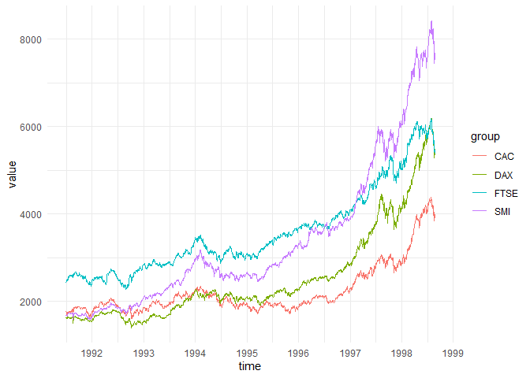

<!-- badges: start -->

[](https://github.com/NicChr/timeplyr/actions/workflows/R-CMD-check.yaml)
[](https://CRAN.R-project.org/package=timeplyr)
[](https://app.codecov.io/gh/NicChr/timeplyr)
<!-- badges: end -->

# timeplyr

# **Fast Tidy Tools for Date and Datetime Manipulation**

This package provides a set of functions to make working with date and
datetime data much easier!

While most time-based packages are designed to work with clean and
pre-aggregate data, timeplyr contains a set of tidy tools to complete,
expand and summarise both raw and aggregate date/datetime data.

Significant efforts have been made to ensure that grouped calculations
are fast and efficient thanks to the excellent functionality within the
[collapse](https://sebkrantz.github.io/collapse/reference/collapse-package.html)
package.

## Installation

You can install and load `timeplyr` using the below code.

``` r
# CRAN version
install.packages("timeplyr")

# Development version
remotes::install_github("NicChr/timeplyr")
```

``` r
library(timeplyr)
```

# Basic examples

## Convert `ts`, `mts`, `xts`, `zoo`and `timeSeries` objects using `ts_as_tbl`

``` r
library(tidyverse)
#> ── Attaching core tidyverse packages ──────────────────────── tidyverse 2.0.0 ──
#> ✔ dplyr     1.1.4     ✔ readr     2.1.5
#> ✔ forcats   1.0.0     ✔ stringr   1.5.1
#> ✔ ggplot2   3.5.1     ✔ tibble    3.2.1
#> ✔ lubridate 1.9.4     ✔ tidyr     1.3.1
#> ✔ purrr     1.0.2     
#> ── Conflicts ────────────────────────────────────────── tidyverse_conflicts() ──
#> ✖ dplyr::filter()       masks stats::filter()
#> ✖ dplyr::lag()          masks stats::lag()
#> ✖ ggplot2::resolution() masks timeplyr::resolution()
#> ℹ Use the conflicted package (<http://conflicted.r-lib.org/>) to force all conflicts to become errors
library(fastplyr)
#> 
#> Attaching package: 'fastplyr'
#> 
#> The following object is masked from 'package:dplyr':
#> 
#>     desc
#> 
#> The following objects are masked from 'package:tidyr':
#> 
#>     crossing, nesting
eu_stock <- EuStockMarkets |>
  ts_as_tbl()
eu_stock
#> # A tibble: 7,440 × 3
#>    group  time value
#>    <chr> <dbl> <dbl>
#>  1 DAX   1991. 1629.
#>  2 DAX   1992. 1614.
#>  3 DAX   1992. 1607.
#>  4 DAX   1992. 1621.
#>  5 DAX   1992. 1618.
#>  6 DAX   1992. 1611.
#>  7 DAX   1992. 1631.
#>  8 DAX   1992. 1640.
#>  9 DAX   1992. 1635.
#> 10 DAX   1992. 1646.
#> # ℹ 7,430 more rows
```

## Easily plot time series using `time_ggplot`

``` r
eu_stock |>
  time_ggplot(time, value, group)
```

<!-- -->

For the next examples we use flights departing from New York City in
2013.

``` r
library(nycflights13)
library(lubridate)
flights <- flights |>
  mutate(date = as_date(time_hour))
```

## `time_by`

### Group your time variable by any time unit

``` r
flights_monthly <- flights |>
  select(date, arr_delay) |>
  time_by(date, "month")

flights_monthly
#> # A tibble: 336,776 x 2
#> # Time:     date [12]
#> # Width:    month
#> # Range:    2013-01-01 -- 2014-01-01
#>    date              arr_delay
#>    <tm_ntrvl>            <dbl>
#>  1 [2013-01-01, +1M)        11
#>  2 [2013-01-01, +1M)        20
#>  3 [2013-01-01, +1M)        33
#>  4 [2013-01-01, +1M)       -18
#>  5 [2013-01-01, +1M)       -25
#>  6 [2013-01-01, +1M)        12
#>  7 [2013-01-01, +1M)        19
#>  8 [2013-01-01, +1M)       -14
#>  9 [2013-01-01, +1M)        -8
#> 10 [2013-01-01, +1M)         8
#> # ℹ 336,766 more rows
```

We can then use this to create a monthly summary of the number of
flights and average arrival delay

``` r
flights_monthly |>
  f_summarise(n = n(),
            mean_arr_delay = mean(arr_delay, na.rm = TRUE))
#> # A tibble: 12 × 3
#>    date                  n mean_arr_delay
#>    <tm_ntrvl>        <int>          <dbl>
#>  1 [2013-01-01, +1M) 27004          6.13 
#>  2 [2013-02-01, +1M) 24951          5.61 
#>  3 [2013-03-01, +1M) 28834          5.81 
#>  4 [2013-04-01, +1M) 28330         11.2  
#>  5 [2013-05-01, +1M) 28796          3.52 
#>  6 [2013-06-01, +1M) 28243         16.5  
#>  7 [2013-07-01, +1M) 29425         16.7  
#>  8 [2013-08-01, +1M) 29327          6.04 
#>  9 [2013-09-01, +1M) 27574         -4.02 
#> 10 [2013-10-01, +1M) 28889         -0.167
#> 11 [2013-11-01, +1M) 27268          0.461
#> 12 [2013-12-01, +1M) 28135         14.9
```

If the time unit is left unspecified, the `time` functions try to find
the highest time unit possible.

``` r
flights |>
  time_by(time_hour)
#> # A tibble: 336,776 x 20
#> # Time:     time_hour [6,936]
#> # Width:    hour
#> # Range:    2013-01-01 05:00:00 -- 2014-01-01
#>     year month   day dep_time sched_dep_time dep_delay arr_time sched_arr_time
#>    <int> <int> <int>    <int>          <int>     <dbl>    <int>          <int>
#>  1  2013     1     1      517            515         2      830            819
#>  2  2013     1     1      533            529         4      850            830
#>  3  2013     1     1      542            540         2      923            850
#>  4  2013     1     1      544            545        -1     1004           1022
#>  5  2013     1     1      554            600        -6      812            837
#>  6  2013     1     1      554            558        -4      740            728
#>  7  2013     1     1      555            600        -5      913            854
#>  8  2013     1     1      557            600        -3      709            723
#>  9  2013     1     1      557            600        -3      838            846
#> 10  2013     1     1      558            600        -2      753            745
#> # ℹ 336,766 more rows
#> # ℹ 12 more variables: arr_delay <dbl>, carrier <chr>, flight <int>,
#> #   tailnum <chr>, origin <chr>, dest <chr>, air_time <dbl>, distance <dbl>,
#> #   hour <dbl>, minute <dbl>, time_hour <tm_ntrvl>, date <date>
```

### We can also make use of timeplyr time intervals

``` r
quarters <- time_cut_width(flights$date, "quarter")
is_time_interval(quarters)
#> [1] TRUE
interval_count(quarters)
#> # A tibble: 4 × 2
#>   interval              n
#>   <tm_ntrvl>        <int>
#> 1 [2013-01-01, +3M) 80789
#> 2 [2013-04-01, +3M) 85369
#> 3 [2013-07-01, +3M) 86326
#> 4 [2013-10-01, +3M) 84292

# Or simply
flights |>
  time_by(date, "quarter") |>
  f_count()
#> # A tibble: 4 x 2
#> # Time:     date [4]
#> # Width:    3 months
#> # Range:    2013-01-01 -- 2014-01-01
#>   date                  n
#>   <tm_ntrvl>        <int>
#> 1 [2013-01-01, +3M) 80789
#> 2 [2013-04-01, +3M) 85369
#> 3 [2013-07-01, +3M) 86326
#> 4 [2013-10-01, +3M) 84292
```

#### Ensure full weeks by setting `from` to the start of the week

``` r
start <- dmy("17-Jan-2013")
flights |> 
  mutate(week = time_cut_width(date, from = floor_date(start, unit = "week"))) |> 
  f_count(week)
#> # A tibble: 354 × 2
#>    week                  n
#>    <tm_ntrvl>        <int>
#>  1 [2013-01-13, +1D)   828
#>  2 [2013-01-14, +1D)   928
#>  3 [2013-01-15, +1D)   894
#>  4 [2013-01-16, +1D)   901
#>  5 [2013-01-17, +1D)   927
#>  6 [2013-01-18, +1D)   924
#>  7 [2013-01-19, +1D)   674
#>  8 [2013-01-20, +1D)   786
#>  9 [2013-01-21, +1D)   912
#> 10 [2013-01-22, +1D)   890
#> # ℹ 344 more rows
```

#### Check for missing gaps in time

``` r
missing_dates(flights$date) # No missing dates
#> Date of length 0
```

``` r
time_num_gaps(flights$time_hour) # Missing hours
#> [1] 1819
```

To check for regularity use `time_is_regular`

``` r
hours <- sort(flights$time_hour)
time_is_regular(hours, "hours")
#> [1] FALSE
time_is_regular(hours, "hours", allow_gaps = TRUE, allow_dups = TRUE)
#> [1] TRUE

# By-group
time_num_gaps(flights$time_hour, g = flights$origin)
#>  EWR  JFK  LGA 
#> 2489 1820 2468
time_is_regular(flights$time_hour, g = flights$origin)
#>   EWR   JFK   LGA 
#> FALSE FALSE FALSE
```

# Grouped rolling time functions

## By-group rolling mean over the last 3 calendar months

``` r
eu_stock <- eu_stock |>
  mutate(date = date_decimal(time))

eu_stock |>
    mutate(month_mean = time_roll_mean(value, window = months(3), 
                                       time = date, 
                                       g = group)) |>
    time_ggplot(date, month_mean, group)
```

<!-- -->

## By-group rolling (locf) NA fill

``` r
# Prerequisite: Create Time series with missing values
x <- ts(c(NA, 3, 4, NA, 6, NA, NA, 8))
g <- cheapr::seq_id(c(3, 5)) # Two groups of size 3 + 5

roll_na_fill(x) # Simple locf fill
#> Time Series:
#> Start = 1 
#> End = 8 
#> Frequency = 1 
#> [1] NA  3  4  4  6  6  6  8
roll_na_fill(x, fill_limit = 1) # Fill up to 1 NA
#> Time Series:
#> Start = 1 
#> End = 8 
#> Frequency = 1 
#> [1] NA  3  4  4  6  6 NA  8

roll_na_fill(x, g = g) # Very efficient on large data too
#> Time Series:
#> Start = 1 
#> End = 8 
#> Frequency = 1 
#> [1] NA  3  4 NA  6  6  6  8
```

## `year_month` and `year_quarter`

timeplyr has its own lightweight ‘yearmonth’ and \`yearquarter’ classes
inspired by the excellent ‘zoo’ and ‘tsibble’ packages.

``` r
today <- today()
year_month(today)
#> [1] "2025 Jan"
```

The underlying data for a `year_month` is the number of months since 1
January 1970 (epoch).

``` r
unclass(year_month("1970-01-01"))
#> [1] 0
unclass(year_month("1971-01-01"))
#> [1] 12
```

To create a sequence of ‘year_months’, one can use base arithmetic

``` r
year_month(today) + 0:12
#>  [1] "2025 Jan" "2025 Feb" "2025 Mar" "2025 Apr" "2025 May" "2025 Jun"
#>  [7] "2025 Jul" "2025 Aug" "2025 Sep" "2025 Oct" "2025 Nov" "2025 Dec"
#> [13] "2026 Jan"
year_quarter(today) + 0:4
#> [1] "2025 Q1" "2025 Q2" "2025 Q3" "2025 Q4" "2026 Q1"
```

## `time_elapsed()`

Let’s look at the time between consecutive flights for a specific flight
number

``` r
set.seed(42)
flight_201 <- flights |>
  f_distinct(time_hour, flight) |>
  f_filter(flight %in% sample(flight, size = 1)) |>
  f_arrange(time_hour)

tail(sort(table(time_elapsed(flight_201$time_hour, "hours"))))
#> 
#>  23  25  48   6  18  24 
#>   2   3   4  33  34 218
```

Flight 201 seems to depart mostly consistently every 24 hours

We can efficiently do the same for all flight numbers

``` r
# We use fdistinct with sort as it's much faster and simpler to write
all_flights <- flights |>
  f_distinct(flight, time_hour, .sort = TRUE)
all_flights <- all_flights |>
  mutate(elapsed = time_elapsed(time_hour, g = flight, fill = 0))

# Flight numbers with largest relative deviation in time between flights
all_flights |>
  tidy_quantiles(elapsed, .by = flight, pivot = "wide") |>
  mutate(relative_iqr = p75 / p25) |>
  f_arrange(desc(relative_iqr))
#> # A tibble: 3,844 × 7
#>    flight    p0   p25   p50   p75  p100 relative_iqr
#>     <int> <dbl> <dbl> <dbl> <dbl> <dbl>        <dbl>
#>  1   3664     0    12    24 3252   6480         271 
#>  2   5709     0    12    24 3080.  6137         257.
#>  3    513     0    12    24 2250.  4477         188.
#>  4   3364     0    12    24 2204.  4385         184.
#>  5   1578     0    24    48 4182.  8317         174.
#>  6   1830     0     1   167  168    168         168 
#>  7   1569     0    18   105 2705   2787         150.
#>  8   1997     0    18    96 2158   8128         120.
#>  9    663     0    24   119 2604   3433         108.
#> 10    233     0     7    14  718   1422         103.
#> # ℹ 3,834 more rows
```

`time_seq_id()` allows us to create unique IDs for regular sequences A
new ID is created every time there is a gap in the sequence

``` r
flights |>
  f_select(time_hour) |>
  f_arrange(time_hour) |>
  mutate(time_id = time_seq_id(time_hour)) |>
  f_filter(time_id != lag(time_id)) |>
  f_count(hour(time_hour))
#> # A tibble: 2 × 2
#>   `hour(time_hour)`     n
#>               <int> <int>
#> 1                 1     1
#> 2                 5   364
```

We can see that the gaps typically occur at 11pm and the sequence
resumes at 5am.

### Other convenience functions are included below

## `calendar()`

#### Easily join common date information to your data

``` r
flights_calendar <- flights |>
    f_select(time_hour) |>
    reframe(calendar(time_hour))
```

Now that gaps in time have been filled and we have joined our date
table, it is easy to count by any time dimension we like

``` r
flights_calendar |> 
  f_count(isoyear, isoweek)
#> # A tibble: 53 × 3
#>    isoyear isoweek     n
#>      <int>   <int> <int>
#>  1    2013       1  5166
#>  2    2013       2  6114
#>  3    2013       3  6034
#>  4    2013       4  6049
#>  5    2013       5  6063
#>  6    2013       6  6104
#>  7    2013       7  6236
#>  8    2013       8  6381
#>  9    2013       9  6444
#> 10    2013      10  6546
#> # ℹ 43 more rows
flights_calendar |> 
  f_count(isoweek = iso_week(time))
#> # A tibble: 53 × 2
#>    isoweek      n
#>    <chr>    <int>
#>  1 2013-W01  5166
#>  2 2013-W02  6114
#>  3 2013-W03  6034
#>  4 2013-W04  6049
#>  5 2013-W05  6063
#>  6 2013-W06  6104
#>  7 2013-W07  6236
#>  8 2013-W08  6381
#>  9 2013-W09  6444
#> 10 2013-W10  6546
#> # ℹ 43 more rows
flights_calendar |> 
  f_count(month_l)
#> # A tibble: 12 × 2
#>    month_l     n
#>    <ord>   <int>
#>  1 Jan     27004
#>  2 Feb     24951
#>  3 Mar     28834
#>  4 Apr     28330
#>  5 May     28796
#>  6 Jun     28243
#>  7 Jul     29425
#>  8 Aug     29327
#>  9 Sep     27574
#> 10 Oct     28889
#> 11 Nov     27268
#> 12 Dec     28135
```

## `.time_units`

See a list of available time units

``` r
.time_units
#>  [1] "picoseconds"  "nanoseconds"  "microseconds" "milliseconds" "seconds"     
#>  [6] "minutes"      "hours"        "days"         "weeks"        "months"      
#> [11] "years"        "fortnights"   "quarters"     "semesters"    "olympiads"   
#> [16] "lustrums"     "decades"      "indictions"   "scores"       "centuries"   
#> [21] "milleniums"
```

## `age_years()`

Calculate ages (years) accurately

``` r
age_years(dmy("28-02-2000"))
#> [1] 24
```

## `time_seq()`

A lubridate version of `seq()` for dates and datetimes

``` r
start <- dmy(31012020)
end <- start + years(1)
seq(start, end, by = "month") # Base R version
#>  [1] "2020-01-31" "2020-03-02" "2020-03-31" "2020-05-01" "2020-05-31"
#>  [6] "2020-07-01" "2020-07-31" "2020-08-31" "2020-10-01" "2020-10-31"
#> [11] "2020-12-01" "2020-12-31" "2021-01-31"
time_seq(start, end, "month") # lubridate version 
#>  [1] "2020-01-31" "2020-02-29" "2020-03-31" "2020-04-30" "2020-05-31"
#>  [6] "2020-06-30" "2020-07-31" "2020-08-31" "2020-09-30" "2020-10-31"
#> [11] "2020-11-30" "2020-12-31" "2021-01-31"
```

`time_seq()` doesn’t mind mixing dates and datetimes

``` r
time_seq(start, as_datetime(end), "2 weeks")
#>  [1] "2020-01-31 UTC" "2020-02-14 UTC" "2020-02-28 UTC" "2020-03-13 UTC"
#>  [5] "2020-03-27 UTC" "2020-04-10 UTC" "2020-04-24 UTC" "2020-05-08 UTC"
#>  [9] "2020-05-22 UTC" "2020-06-05 UTC" "2020-06-19 UTC" "2020-07-03 UTC"
#> [13] "2020-07-17 UTC" "2020-07-31 UTC" "2020-08-14 UTC" "2020-08-28 UTC"
#> [17] "2020-09-11 UTC" "2020-09-25 UTC" "2020-10-09 UTC" "2020-10-23 UTC"
#> [21] "2020-11-06 UTC" "2020-11-20 UTC" "2020-12-04 UTC" "2020-12-18 UTC"
#> [25] "2021-01-01 UTC" "2021-01-15 UTC" "2021-01-29 UTC"
```

## `time_seq_v()`

A vectorised version of `time_seq()` Currently it is vectorised over
from, to and by

``` r
# 3 sequences
time_seq_v(from = start, 
           to = end, 
           timespan("months", 1:3))
#>  [1] "2020-01-31" "2020-02-29" "2020-03-31" "2020-04-30" "2020-05-31"
#>  [6] "2020-06-30" "2020-07-31" "2020-08-31" "2020-09-30" "2020-10-31"
#> [11] "2020-11-30" "2020-12-31" "2021-01-31" "2020-01-31" "2020-03-31"
#> [16] "2020-05-31" "2020-07-31" "2020-09-30" "2020-11-30" "2021-01-31"
#> [21] "2020-01-31" "2020-04-30" "2020-07-31" "2020-10-31" "2021-01-31"
# Equivalent to 
c(time_seq(start, end, "month"),
  time_seq(start, end, "2 months"),
  time_seq(start, end, "3 months"))
#>  [1] "2020-01-31" "2020-02-29" "2020-03-31" "2020-04-30" "2020-05-31"
#>  [6] "2020-06-30" "2020-07-31" "2020-08-31" "2020-09-30" "2020-10-31"
#> [11] "2020-11-30" "2020-12-31" "2021-01-31" "2020-01-31" "2020-03-31"
#> [16] "2020-05-31" "2020-07-31" "2020-09-30" "2020-11-30" "2021-01-31"
#> [21] "2020-01-31" "2020-04-30" "2020-07-31" "2020-10-31" "2021-01-31"
```

## `time_seq_sizes()`

Vectorised function that calculates time sequence lengths

``` r
seq_lengths <- time_seq_sizes(start, start + days(c(1, 10, 20)), 
                              timespan("days", c(1, 5, 10)))
seq_lengths
#> [1] 2 3 3

# Use time_seq_v2() if you know the sequence lengths
seqs <- time_seq_v2(seq_lengths, start, timespan("days", c(1, 5, 10)))
seqs
#> [1] "2020-01-31" "2020-02-01" "2020-01-31" "2020-02-05" "2020-02-10"
#> [6] "2020-01-31" "2020-02-10" "2020-02-20"
```

Dealing with impossible dates and datetimes is very simple

``` r
time_seq(start, end, "month", roll_month = "postday") # roll impossible months forward
#>  [1] "2020-01-31" "2020-03-01" "2020-03-31" "2020-05-01" "2020-05-31"
#>  [6] "2020-07-01" "2020-07-31" "2020-08-31" "2020-10-01" "2020-10-31"
#> [11] "2020-12-01" "2020-12-31" "2021-01-31"
time_seq(start, end, "month", roll_month = "NA") # no roll
#>  [1] "2020-01-31" NA           "2020-03-31" NA           "2020-05-31"
#>  [6] NA           "2020-07-31" "2020-08-31" NA           "2020-10-31"
#> [11] NA           "2020-12-31" "2021-01-31"
```

## `iso_week()`

Simple function to get formatted ISO weeks.

``` r
iso_week(today())
#> [1] "2025-W03"
iso_week(today(), day = TRUE)
#> [1] "2025-W03-5"
iso_week(today(), year = FALSE)
#> [1] "W03"
```

## `time_cut()`

Create pretty time axes using `time_breaks()`

``` r
times <- flights$time_hour
dates <- flights$date

date_breaks <- time_breaks(dates, n = 12)
time_breaks <- time_breaks(times, n = 12, time_floor = TRUE)

weekly_data <- flights |>
    time_by(date, "week",
            .name = "date") |>
    f_count()
weekly_data |>
  ggplot(aes(x = interval_start(date), y = n)) + 
  geom_bar(stat = "identity", fill = "#0072B2") + 
  scale_x_date(breaks = date_breaks, labels = scales::label_date_short()) 
```

<!-- -->

``` r

flights |>
  ggplot(aes(x = time_hour)) + 
  geom_bar(fill = "#0072B2") + 
  scale_x_datetime(breaks = time_breaks, labels = scales::label_date_short())
```

<!-- -->
