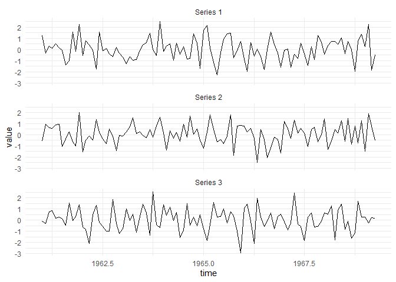
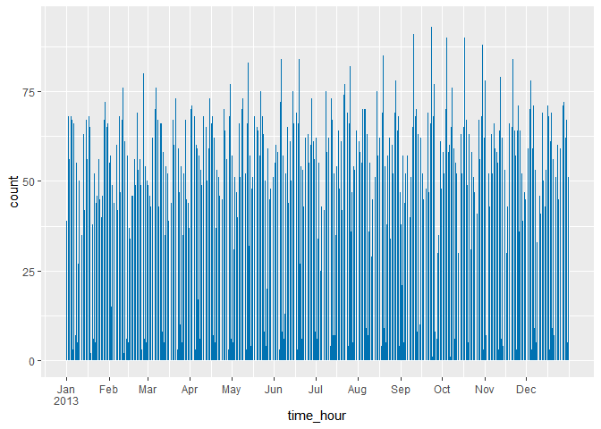

<!-- badges: start -->

[](https://github.com/NicChr/timeplyr/actions/workflows/R-CMD-check.yaml)
<!-- badges: end -->

# timeplyr

# **A date and datetime extension to dplyr**

This package provides a set of functions to make working with date and
datetime data much easier!

While most time-based packages are designed to work with clean and
pre-aggregate data,  
timeplyr contains a set of tidy tools to complete, expand and summarise
both raw and aggregate date/datetime data.

It introduces no new classes.

## Installation

You can install and load `timeplyr` using the below code.

``` r
remotes::install_github("NicChr/timeplyr")
```

``` r
library(timeplyr)
```

## Notes

**All functions that accept a data argument are tidyverse friendly and
can handle grouped calculations**

The `time_` functions that accept a data frame argument all operate
similarly to the tidyverse equivalents but additionally accept a `time`
argument to allow for date/datetime implicit missing value completion,
expansion and aggregation.

-   `time_count` - Time-based `dplyr::count`
-   `time_summarise` - Time-based `dplyr::summarise`
-   `time_mutate` - Time-based `dplyr::mutate`
-   `time_expand` - Time-based `tidyr::expand`
-   `time_complete` - Time-based `tidyr::complete`

For example, `data %>% time_count(time = date, by = "month")` will:

-   Fill in missing gaps in time  
-   Count the dates by month

There are many more options to allow for more flexible time
summarisation, such as choosing start/end times, flooring dates to get
full time units (e.g months), and many others.

## Fast functions

There are also a few dplyr alternatives designed to work faster on large
numbers of groups.

-   `fcount` - `dplyr::count` alternative
-   `fdistinct` - `dplyr::distinct` alternative
-   `fduplicates` - Finds duplicate rows, similar to
    `data %>% group_by() %>% filter(n() > 1)`
-   `fslice` - `dplyr::slice` alternative

## Vector time functions

There are also vector versions of the tidy equivalents, designed for use
on atomic vectors. These include: `time_countv`, `time_expandv`,
`time_summarisev` and `time_completev`.

## Some simple examples

We use flights departing from New York City in 2013.

``` r
library(tidyverse)
#> -- Attaching core tidyverse packages ------------------------ tidyverse 2.0.0 --
#> v dplyr     1.1.1     v readr     2.1.3
#> v forcats   0.5.2     v stringr   1.5.0
#> v ggplot2   3.4.1     v tibble    3.2.0
#> v lubridate 1.9.2     v tidyr     1.3.0
#> v purrr     1.0.1     
#> -- Conflicts ------------------------------------------ tidyverse_conflicts() --
#> x dplyr::filter() masks stats::filter()
#> x dplyr::lag()    masks stats::lag()
#> i Use the conflicted package (<http://conflicted.r-lib.org/>) to force all conflicts to become errors
library(lubridate)
library(nycflights13)
flights <- flights %>%
  mutate(date = as_date(time_hour))
```

## `time_count()`

#### Easily fill in implicit missing gaps and aggregate time.

``` r
flights_ts <- flights %>%
  time_count(time = time_hour)
#> Assuming a time granularity of 1 hour(s)
flights_ts
#> # A tibble: 8,755 x 2
#>    time_hour               n
#>  * <dttm>              <int>
#>  1 2013-01-01 05:00:00     6
#>  2 2013-01-01 06:00:00    52
#>  3 2013-01-01 07:00:00    49
#>  4 2013-01-01 08:00:00    58
#>  5 2013-01-01 09:00:00    56
#>  6 2013-01-01 10:00:00    39
#>  7 2013-01-01 11:00:00    37
#>  8 2013-01-01 12:00:00    56
#>  9 2013-01-01 13:00:00    54
#> 10 2013-01-01 14:00:00    48
#> # ... with 8,745 more rows
```

#### Dates work as easily as datetimes

``` r
flights %>%
  time_count(time = across(time_hour, as_date),
             by = "day")
#> # A tibble: 365 x 2
#>    time_hour      n
#>  * <date>     <int>
#>  1 2013-01-01   842
#>  2 2013-01-02   943
#>  3 2013-01-03   914
#>  4 2013-01-04   915
#>  5 2013-01-05   720
#>  6 2013-01-06   832
#>  7 2013-01-07   933
#>  8 2013-01-08   899
#>  9 2013-01-09   902
#> 10 2013-01-10   932
#> # ... with 355 more rows
```

#### Specify time aggregation through `by`

``` r
# Some examples
flights %>%
  time_count(time = across(time_hour, as_date),
             by = "7 days")
#> # A tibble: 53 x 2
#>    time_hour      n
#>  * <date>     <int>
#>  1 2013-01-01  6099
#>  2 2013-01-08  6109
#>  3 2013-01-15  6018
#>  4 2013-01-22  6060
#>  5 2013-01-29  6072
#>  6 2013-02-05  6101
#>  7 2013-02-12  6255
#>  8 2013-02-19  6394
#>  9 2013-02-26  6460
#> 10 2013-03-05  6549
#> # ... with 43 more rows
flights %>%
  time_count(time = across(time_hour, as_date),
             by = "2 weeks")
#> # A tibble: 27 x 2
#>    time_hour      n
#>  * <date>     <int>
#>  1 2013-01-01 12208
#>  2 2013-01-15 12078
#>  3 2013-01-29 12173
#>  4 2013-02-12 12649
#>  5 2013-02-26 13009
#>  6 2013-03-12 13100
#>  7 2013-03-26 13145
#>  8 2013-04-09 13239
#>  9 2013-04-23 13080
#> 10 2013-05-07 13019
#> # ... with 17 more rows
flights %>%
  time_count(time = across(time_hour, as_date),
             by = "fortnight")
#> # A tibble: 27 x 2
#>    time_hour      n
#>  * <date>     <int>
#>  1 2013-01-01 12208
#>  2 2013-01-15 12078
#>  3 2013-01-29 12173
#>  4 2013-02-12 12649
#>  5 2013-02-26 13009
#>  6 2013-03-12 13100
#>  7 2013-03-26 13145
#>  8 2013-04-09 13239
#>  9 2013-04-23 13080
#> 10 2013-05-07 13019
#> # ... with 17 more rows
flights %>%
  time_count(time = across(time_hour, as_date),
             by = "month")
#> # A tibble: 12 x 2
#>    time_hour      n
#>  * <date>     <int>
#>  1 2013-01-01 27004
#>  2 2013-02-01 24951
#>  3 2013-03-01 28834
#>  4 2013-04-01 28330
#>  5 2013-05-01 28796
#>  6 2013-06-01 28243
#>  7 2013-07-01 29425
#>  8 2013-08-01 29327
#>  9 2013-09-01 27574
#> 10 2013-10-01 28889
#> 11 2013-11-01 27268
#> 12 2013-12-01 28135
flights %>%
  time_count(time = across(time_hour, as_date),
             by = "quarter")
#> # A tibble: 4 x 2
#>   time_hour      n
#> * <date>     <int>
#> 1 2013-01-01 80789
#> 2 2013-04-01 85369
#> 3 2013-07-01 86326
#> 4 2013-10-01 84292
flights %>%
  time_count(time = across(time_hour, as_date),
             by = "year")
#> # A tibble: 1 x 2
#>   time_hour       n
#> * <date>      <int>
#> 1 2013-01-01 336776
```

#### Ensure full weeks/months/years by using `floor_date = TRUE`

``` r
start <- dmy("17-Jan-2013")
flights %>%
  time_count(time = across(time_hour, as_date),
             by = "week", from = start, floor_date = TRUE)
#> # A tibble: 51 x 2
#>    time_hour      n
#>  * <date>     <int>
#>  1 2013-01-14  3311
#>  2 2013-01-21  6049
#>  3 2013-01-28  6063
#>  4 2013-02-04  6104
#>  5 2013-02-11  6236
#>  6 2013-02-18  6381
#>  7 2013-02-25  6444
#>  8 2013-03-04  6546
#>  9 2013-03-11  6555
#> 10 2013-03-18  6547
#> # ... with 41 more rows
flights %>%
  time_count(time = across(time_hour, as_date),
             by = "month", from = start, floor_date = TRUE)
#> # A tibble: 12 x 2
#>    time_hour      n
#>  * <date>     <int>
#>  1 2013-01-01 13001
#>  2 2013-02-01 24951
#>  3 2013-03-01 28834
#>  4 2013-04-01 28330
#>  5 2013-05-01 28796
#>  6 2013-06-01 28243
#>  7 2013-07-01 29425
#>  8 2013-08-01 29327
#>  9 2013-09-01 27574
#> 10 2013-10-01 28889
#> 11 2013-11-01 27268
#> 12 2013-12-01 28135
```

## `missing_dates()`

#### Check for missing gaps in time

``` r
missing_dates(flights) # No missing dates
#> $time_hour
#> Date of length 0
#> 
#> $date
#> Date of length 0
length(time_missing(flights$time_hour, by = "hour")) # Missing hours
#> [1] 1819
time_missing(flights$date, by = "day") # Missing days
#> Date of length 0
```

#### Alternatively, counts with `time_countv()`

``` r
flight_counts <- time_countv(flights$time_hour, by = "hour")
flights_ts %>%
  mutate(n2 = flight_counts)
#> # A tibble: 8,755 x 3
#>    time_hour               n    n2
#>    <dttm>              <int> <int>
#>  1 2013-01-01 05:00:00     6     6
#>  2 2013-01-01 06:00:00    52    52
#>  3 2013-01-01 07:00:00    49    49
#>  4 2013-01-01 08:00:00    58    58
#>  5 2013-01-01 09:00:00    56    56
#>  6 2013-01-01 10:00:00    39    39
#>  7 2013-01-01 11:00:00    37    37
#>  8 2013-01-01 12:00:00    56    56
#>  9 2013-01-01 13:00:00    54    54
#> 10 2013-01-01 14:00:00    48    48
#> # ... with 8,745 more rows
```

## `time_expand()`

All the `time_` functions with a data argument work with groups. Here we
create a weekly time sequence for each origin and destination

``` r
origin_dest_seq <- flights %>%
  group_by(origin, dest) %>%
  time_expand(time = date, by = "week")
```

Another thing to note is that all `time_` functions have a `seq_type`
argument to let you specify if you want durations or periods. By default
it is “auto” which chooses periods for time units greater or equal to
days and durations otherwise.

``` r
start <- dmy("01-01-2023")
time_seq(start, start + years(1), 
         by = "month",
         seq_type = "period")
#>  [1] "2023-01-01" "2023-02-01" "2023-03-01" "2023-04-01" "2023-05-01"
#>  [6] "2023-06-01" "2023-07-01" "2023-08-01" "2023-09-01" "2023-10-01"
#> [11] "2023-11-01" "2023-12-01" "2024-01-01"
time_seq(start, start + years(1), 
         by = "month",
         seq_type = "duration")
#>  [1] "2023-01-01 00:00:00 UTC" "2023-01-31 10:30:00 UTC"
#>  [3] "2023-03-02 21:00:00 UTC" "2023-04-02 07:30:00 UTC"
#>  [5] "2023-05-02 18:00:00 UTC" "2023-06-02 04:30:00 UTC"
#>  [7] "2023-07-02 15:00:00 UTC" "2023-08-02 01:30:00 UTC"
#>  [9] "2023-09-01 12:00:00 UTC" "2023-10-01 22:30:00 UTC"
#> [11] "2023-11-01 09:00:00 UTC" "2023-12-01 19:30:00 UTC"
```

When you supply groups to `time_expand()` the start and end points are
unique to each group. We confirm this below

``` r
origin_dest_seq %>%
  summarise(from = min(date),
            to = max(date)) %>%
  ungroup() %>%
  distinct(from, to, .keep_all = TRUE)
#> `summarise()` has grouped output by 'origin'. You can override using the
#> `.groups` argument.
#> # A tibble: 45 x 4
#>    origin dest  from       to        
#>    <chr>  <chr> <date>     <date>    
#>  1 EWR    ALB   2013-01-01 2013-12-31
#>  2 EWR    ANC   2013-07-06 2013-08-24
#>  3 EWR    BDL   2013-01-01 2013-12-17
#>  4 EWR    BZN   2013-01-05 2013-12-28
#>  5 EWR    CAE   2013-01-03 2013-12-26
#>  6 EWR    DSM   2013-01-01 2013-12-24
#>  7 EWR    LGA   2013-07-27 2013-07-27
#>  8 EWR    MYR   2013-01-01 2013-04-02
#>  9 EWR    ORF   2013-01-02 2013-12-25
#> 10 EWR    PHL   2013-01-03 2013-04-04
#> # ... with 35 more rows
```

The ability to create time sequences by group is one of the most
powerful features of timeplyr.

## `time_complete()`

#### We could instead use `fcount()` and `time_complete()` to

#### count the hours with no gaps.

``` r
flights %>%
  group_by(origin, dest) %>%
  fcount(time_hour) %>%
  time_complete(time = time_hour, 
                by = "hour", 
                fill = list(n = 0))
#> # A tibble: 1,756,358 x 4
#> # Groups:   origin, dest [224]
#>    origin dest  time_hour               n
#>  * <chr>  <chr> <dttm>              <dbl>
#>  1 EWR    ALB   2013-01-01 13:00:00     1
#>  2 EWR    ALB   2013-01-01 14:00:00     0
#>  3 EWR    ALB   2013-01-01 15:00:00     0
#>  4 EWR    ALB   2013-01-01 16:00:00     1
#>  5 EWR    ALB   2013-01-01 17:00:00     0
#>  6 EWR    ALB   2013-01-01 18:00:00     0
#>  7 EWR    ALB   2013-01-01 19:00:00     0
#>  8 EWR    ALB   2013-01-01 20:00:00     1
#>  9 EWR    ALB   2013-01-01 21:00:00     0
#> 10 EWR    ALB   2013-01-01 22:00:00     0
#> # ... with 1,756,348 more rows
```

## `time_span()`

#### Alternatively using `time_span()` and `fcomplete()`

``` r
hour_seq <- time_span(flights$time_hour, by = "hour")
flights %>%
  group_by(origin, dest) %>%
  fcount(time_hour) %>%
  fcomplete(time_hour = hour_seq,
            fill = list(n = 0))
#> # A tibble: 1,961,120 x 4
#> # Groups:   origin, dest [224]
#>    origin dest  time_hour               n
#>  * <chr>  <chr> <dttm>              <dbl>
#>  1 EWR    ALB   2013-01-01 13:00:00     1
#>  2 EWR    ALB   2013-01-01 16:00:00     1
#>  3 EWR    ALB   2013-01-01 20:00:00     1
#>  4 EWR    ALB   2013-01-02 13:00:00     1
#>  5 EWR    ALB   2013-01-02 16:00:00     1
#>  6 EWR    ALB   2013-01-02 20:00:00     1
#>  7 EWR    ALB   2013-01-03 16:00:00     1
#>  8 EWR    ALB   2013-01-03 20:00:00     1
#>  9 EWR    ALB   2013-01-04 16:00:00     1
#> 10 EWR    ALB   2013-01-04 20:00:00     1
#> # ... with 1,961,110 more rows
```

#### The above has the same expanded time sequence for each group and

#### can be achieved using `time_count()` as well

``` r
flights %>%
  time_count(origin, dest, time = time_hour, by = "hour")
#> # A tibble: 1,961,120 x 4
#>    time_hour           origin dest      n
#>  * <dttm>              <chr>  <chr> <int>
#>  1 2013-01-01 05:00:00 EWR    ALB       0
#>  2 2013-01-01 05:00:00 EWR    ANC       0
#>  3 2013-01-01 05:00:00 EWR    ATL       0
#>  4 2013-01-01 05:00:00 EWR    AUS       0
#>  5 2013-01-01 05:00:00 EWR    AVL       0
#>  6 2013-01-01 05:00:00 EWR    BDL       0
#>  7 2013-01-01 05:00:00 EWR    BNA       0
#>  8 2013-01-01 05:00:00 EWR    BOS       0
#>  9 2013-01-01 05:00:00 EWR    BQN       0
#> 10 2013-01-01 05:00:00 EWR    BTV       0
#> # ... with 1,961,110 more rows
```

## `add_calendar()`

#### Easily join common date information to your data

``` r
flights_ts <- flights_ts %>%
  add_calendar(time_hour)
#> New columns added:
#> year, quarter, month, month_l, week, day, yday, isoyear, isoweek, isoday, epiyear, epiweek, wday, wday_l, hour, minute, second
```

Now that gaps in time have been filled and we have joined our date
table, it is easy to count by any time dimension we like

``` r
flights_ts %>% 
  fcount(isoyear, isoweek, wt = n)
#> # A tibble: 53 x 3
#>    isoyear isoweek     n
#>  *   <int>   <int> <int>
#>  1    2013       1  5166
#>  2    2013       2  6114
#>  3    2013       3  6034
#>  4    2013       4  6049
#>  5    2013       5  6063
#>  6    2013       6  6104
#>  7    2013       7  6236
#>  8    2013       8  6381
#>  9    2013       9  6444
#> 10    2013      10  6546
#> # ... with 43 more rows
flights_ts %>% 
  fcount(isoweek = iso_week(time_hour), wt = n)
#> # A tibble: 53 x 2
#>    isoweek      n
#>  * <chr>    <int>
#>  1 2013-W01  5166
#>  2 2013-W02  6114
#>  3 2013-W03  6034
#>  4 2013-W04  6049
#>  5 2013-W05  6063
#>  6 2013-W06  6104
#>  7 2013-W07  6236
#>  8 2013-W08  6381
#>  9 2013-W09  6444
#> 10 2013-W10  6546
#> # ... with 43 more rows
flights_ts %>% 
  fcount(month_l, wt = n)
#> # A tibble: 12 x 2
#>    month_l     n
#>  * <ord>   <int>
#>  1 Jan     27004
#>  2 Feb     24951
#>  3 Mar     28834
#>  4 Apr     28330
#>  5 May     28796
#>  6 Jun     28243
#>  7 Jul     29425
#>  8 Aug     29327
#>  9 Sep     27574
#> 10 Oct     28889
#> 11 Nov     27268
#> 12 Dec     28135
```

#### To ensure full weeks, set `floor_date = TRUE` and `by = "week"`.

``` r
flights %>%
  time_count(time = time_hour,
             by = "week", 
             floor_date = TRUE)
#> # A tibble: 53 x 2
#>    time_hour               n
#>  * <dttm>              <int>
#>  1 2012-12-31 00:00:00  5166
#>  2 2013-01-07 00:00:00  6114
#>  3 2013-01-14 00:00:00  6034
#>  4 2013-01-21 00:00:00  6049
#>  5 2013-01-28 00:00:00  6063
#>  6 2013-02-04 00:00:00  6104
#>  7 2013-02-11 00:00:00  6236
#>  8 2013-02-18 00:00:00  6381
#>  9 2013-02-25 00:00:00  6444
#> 10 2013-03-04 00:00:00  6546
#> # ... with 43 more rows
```

## `time_summarise()`

We can do more than just counts, actually any summary using
`time_summarise()` We can for example, calculate mean arrival and
departure times by month

``` r
flights %>%
  time_summarise(across(c(arr_time, dep_time), 
                        ~ mean(.x, na.rm = TRUE)),
                 time = time_hour, 
                 by = "month",  
                 floor_date = TRUE,
                 include_interval = TRUE)
#> # A tibble: 12 x 4
#>    time_hour           interval                                arr_time dep_time
#>    <dttm>              <Interval>                                 <dbl>    <dbl>
#>  1 2013-01-01 00:00:00 2013-01-01 EST--2013-02-01 00:00:00 EST    1523.    1347.
#>  2 2013-02-01 00:00:00 2013-02-01 EST--2013-03-01 00:00:00 EST    1522.    1348.
#>  3 2013-03-01 00:00:00 2013-03-01 EST--2013-04-01 00:00:00 EDT    1510.    1359.
#>  4 2013-04-01 00:00:00 2013-04-01 EDT--2013-05-01 00:00:00 EDT    1501.    1353.
#>  5 2013-05-01 00:00:00 2013-05-01 EDT--2013-06-01 00:00:00 EDT    1503.    1351.
#>  6 2013-06-01 00:00:00 2013-06-01 EDT--2013-07-01 00:00:00 EDT    1468.    1351.
#>  7 2013-07-01 00:00:00 2013-07-01 EDT--2013-08-01 00:00:00 EDT    1456.    1353.
#>  8 2013-08-01 00:00:00 2013-08-01 EDT--2013-09-01 00:00:00 EDT    1495.    1350.
#>  9 2013-09-01 00:00:00 2013-09-01 EDT--2013-10-01 00:00:00 EDT    1504.    1334.
#> 10 2013-10-01 00:00:00 2013-10-01 EDT--2013-11-01 00:00:00 EDT    1520.    1340.
#> 11 2013-11-01 00:00:00 2013-11-01 EDT--2013-12-01 00:00:00 EST    1523.    1344.
#> 12 2013-12-01 00:00:00 2013-12-01 EST--2013-12-31 23:00:00 EST    1505.    1357.
```

## `time_mutate()`

A time-based version of mutate

``` r
flights %>%
  time_mutate(time = date, by = "quarter",
              .keep = "none") %>%
  fcount(date)
#> # A tibble: 4 x 2
#>   date           n
#> * <date>     <int>
#> 1 2013-01-01 80789
#> 2 2013-04-01 85369
#> 3 2013-07-01 86326
#> 4 2013-10-01 84292
```

### Other convenience functions are included below

## `.time_units`

See a list of available time units

``` r
.time_units
#>  [1] "picoseconds"  "nanoseconds"  "microseconds" "milliseconds" "seconds"     
#>  [6] "minutes"      "hours"        "days"         "weeks"        "months"      
#> [11] "years"        "fortnights"   "quarters"     "semesters"    "olympiads"   
#> [16] "lustrums"     "decades"      "indictions"   "scores"       "centuries"   
#> [21] "milleniums"
```

## `age_years()`

Calculate ages (years) accurately

``` r
age_years(dmy("28-02-2000"))
#> [1] 23
```

## `time_seq()`

A lubridate version of `seq()` for dates and datetimes

``` r
start <- dmy(31012020)
end <- start + years(1)
seq(start, end, by = "month") # Base R version
#>  [1] "2020-01-31" "2020-03-02" "2020-03-31" "2020-05-01" "2020-05-31"
#>  [6] "2020-07-01" "2020-07-31" "2020-08-31" "2020-10-01" "2020-10-31"
#> [11] "2020-12-01" "2020-12-31" "2021-01-31"
time_seq(start, end, by = "month") # lubridate version
#>  [1] "2020-01-31" "2020-02-29" "2020-03-31" "2020-04-30" "2020-05-31"
#>  [6] "2020-06-30" "2020-07-31" "2020-08-31" "2020-09-30" "2020-10-31"
#> [11] "2020-11-30" "2020-12-31" "2021-01-31"
```

`time_seq()` doesn’t mind mixing dates and datetimes

``` r
time_seq(start, as_datetime(end), by = "2 weeks")
#>  [1] "2020-01-31 UTC" "2020-02-14 UTC" "2020-02-28 UTC" "2020-03-13 UTC"
#>  [5] "2020-03-27 UTC" "2020-04-10 UTC" "2020-04-24 UTC" "2020-05-08 UTC"
#>  [9] "2020-05-22 UTC" "2020-06-05 UTC" "2020-06-19 UTC" "2020-07-03 UTC"
#> [13] "2020-07-17 UTC" "2020-07-31 UTC" "2020-08-14 UTC" "2020-08-28 UTC"
#> [17] "2020-09-11 UTC" "2020-09-25 UTC" "2020-10-09 UTC" "2020-10-23 UTC"
#> [21] "2020-11-06 UTC" "2020-11-20 UTC" "2020-12-04 UTC" "2020-12-18 UTC"
#> [25] "2021-01-01 UTC" "2021-01-15 UTC" "2021-01-29 UTC"
```

## `time_seq_v()`

A vectorised version of `time_seq()` Currently it vectorised over from,
to and num

``` r
# 3 sequences
time_seq_v(from = start, 
           to = end, 
           units = "months", 
           num = 1:3)
#>  [1] "2020-01-31" "2020-02-29" "2020-03-31" "2020-04-30" "2020-05-31"
#>  [6] "2020-06-30" "2020-07-31" "2020-08-31" "2020-09-30" "2020-10-31"
#> [11] "2020-11-30" "2020-12-31" "2021-01-31" "2020-01-31" "2020-03-31"
#> [16] "2020-05-31" "2020-07-31" "2020-09-30" "2020-11-30" "2021-01-31"
#> [21] "2020-01-31" "2020-04-30" "2020-07-31" "2020-10-31" "2021-01-31"
# Equivalent to 
c(time_seq(start, end, by = "month"),
  time_seq(start, end, by = "2 months"),
  time_seq(start, end, by = "3 months"))
#>  [1] "2020-01-31" "2020-02-29" "2020-03-31" "2020-04-30" "2020-05-31"
#>  [6] "2020-06-30" "2020-07-31" "2020-08-31" "2020-09-30" "2020-10-31"
#> [11] "2020-11-30" "2020-12-31" "2021-01-31" "2020-01-31" "2020-03-31"
#> [16] "2020-05-31" "2020-07-31" "2020-09-30" "2020-11-30" "2021-01-31"
#> [21] "2020-01-31" "2020-04-30" "2020-07-31" "2020-10-31" "2021-01-31"
```

## `time_seq_len()`

Vectorised function that calculates time sequence lengths

``` r
time_seq_len(start, start + years(1:10), 
             by = list("days" = sample(1:10)))
#>  [1]   62   74  275  183  914  244  853  585 3289  522
```

Dealing with impossible dates and datetimes is very simple

``` r
time_seq(start, end, by = "month", roll_month = "postday") # roll impossible months forward
#>  [1] "2020-01-31" "2020-03-01" "2020-03-31" "2020-05-01" "2020-05-31"
#>  [6] "2020-07-01" "2020-07-31" "2020-08-31" "2020-10-01" "2020-10-31"
#> [11] "2020-12-01" "2020-12-31" "2021-01-31"
time_seq(start, end, by = "month", roll_month = "NA") # no roll
#>  [1] "2020-01-31" NA           "2020-03-31" NA           "2020-05-31"
#>  [6] NA           "2020-07-31" "2020-08-31" NA           "2020-10-31"
#> [11] NA           "2020-12-31" "2021-01-31"

time_seq(start, end, by = "month", seq_type = "duration") # lubridate version with durations
#>  [1] "2020-01-31 00:00:00 UTC" "2020-03-01 10:30:00 UTC"
#>  [3] "2020-03-31 21:00:00 UTC" "2020-05-01 07:30:00 UTC"
#>  [5] "2020-05-31 18:00:00 UTC" "2020-07-01 04:30:00 UTC"
#>  [7] "2020-07-31 15:00:00 UTC" "2020-08-31 01:30:00 UTC"
#>  [9] "2020-09-30 12:00:00 UTC" "2020-10-30 22:30:00 UTC"
#> [11] "2020-11-30 09:00:00 UTC" "2020-12-30 19:30:00 UTC"
#> [13] "2021-01-30 06:00:00 UTC"
```

## `iso_week()`

Simple function to get formatted ISO weeks.

``` r
iso_week(today())
#> [1] "2023-W13"
iso_week(today(), day = TRUE)
#> [1] "2023-W13-5"
iso_week(today(), year = FALSE)
#> [1] "W13"
```

Helpers like `calendar()`, `create_calendar()` and `add_calendar()` can
make time sequence tibbles.

``` r
my_seq <- time_seq(start, end, by = "day")
calendar(my_seq)
#> # A tibble: 367 x 15
#>    time        year quarter month month_l  week   day  yday isoyear isoweek
#>    <date>     <int>   <int> <int> <ord>   <int> <int> <int>   <int>   <int>
#>  1 2020-01-31  2020       1     1 Jan         5    31    31    2020       5
#>  2 2020-02-01  2020       1     2 Feb         5     1    32    2020       5
#>  3 2020-02-02  2020       1     2 Feb         5     2    33    2020       5
#>  4 2020-02-03  2020       1     2 Feb         5     3    34    2020       6
#>  5 2020-02-04  2020       1     2 Feb         5     4    35    2020       6
#>  6 2020-02-05  2020       1     2 Feb         6     5    36    2020       6
#>  7 2020-02-06  2020       1     2 Feb         6     6    37    2020       6
#>  8 2020-02-07  2020       1     2 Feb         6     7    38    2020       6
#>  9 2020-02-08  2020       1     2 Feb         6     8    39    2020       6
#> 10 2020-02-09  2020       1     2 Feb         6     9    40    2020       6
#> # ... with 357 more rows, and 5 more variables: isoday <int>, epiyear <int>,
#> #   epiweek <int>, wday <int>, wday_l <ord>
create_calendar(start, end, by = "day") # The same style as time_seq
#> # A tibble: 367 x 15
#>    time        year quarter month month_l  week   day  yday isoyear isoweek
#>    <date>     <int>   <int> <int> <ord>   <int> <int> <int>   <int>   <int>
#>  1 2020-01-31  2020       1     1 Jan         5    31    31    2020       5
#>  2 2020-02-01  2020       1     2 Feb         5     1    32    2020       5
#>  3 2020-02-02  2020       1     2 Feb         5     2    33    2020       5
#>  4 2020-02-03  2020       1     2 Feb         5     3    34    2020       6
#>  5 2020-02-04  2020       1     2 Feb         5     4    35    2020       6
#>  6 2020-02-05  2020       1     2 Feb         6     5    36    2020       6
#>  7 2020-02-06  2020       1     2 Feb         6     6    37    2020       6
#>  8 2020-02-07  2020       1     2 Feb         6     7    38    2020       6
#>  9 2020-02-08  2020       1     2 Feb         6     8    39    2020       6
#> 10 2020-02-09  2020       1     2 Feb         6     9    40    2020       6
#> # ... with 357 more rows, and 5 more variables: isoday <int>, epiyear <int>,
#> #   epiweek <int>, wday <int>, wday_l <ord>
# Tidy version
tibble(my_seq) %>%
  add_calendar(my_seq)
#> New columns added:
#> year, quarter, month, month_l, week, day, yday, isoyear, isoweek, isoday, epiyear, epiweek, wday, wday_l
#> # A tibble: 367 x 15
#>    my_seq      year quarter month month_l  week   day  yday isoyear isoweek
#>    <date>     <int>   <int> <int> <ord>   <int> <int> <int>   <int>   <int>
#>  1 2020-01-31  2020       1     1 Jan         5    31    31    2020       5
#>  2 2020-02-01  2020       1     2 Feb         5     1    32    2020       5
#>  3 2020-02-02  2020       1     2 Feb         5     2    33    2020       5
#>  4 2020-02-03  2020       1     2 Feb         5     3    34    2020       6
#>  5 2020-02-04  2020       1     2 Feb         5     4    35    2020       6
#>  6 2020-02-05  2020       1     2 Feb         6     5    36    2020       6
#>  7 2020-02-06  2020       1     2 Feb         6     6    37    2020       6
#>  8 2020-02-07  2020       1     2 Feb         6     7    38    2020       6
#>  9 2020-02-08  2020       1     2 Feb         6     8    39    2020       6
#> 10 2020-02-09  2020       1     2 Feb         6     9    40    2020       6
#> # ... with 357 more rows, and 5 more variables: isoday <int>, epiyear <int>,
#> #   epiweek <int>, wday <int>, wday_l <ord>
```

## `time_cut()`

Create pretty time axes using `time_cut()` and `time_breaks()`

``` r
times <- flights$time_hour
dates <- flights$date

levels(time_cut(dates, n = 10))
#> [1] "[2013-01-01, 2013-03-01)" "[2013-03-01, 2013-05-01)"
#> [3] "[2013-05-01, 2013-07-01)" "[2013-07-01, 2013-09-01)"
#> [5] "[2013-09-01, 2013-11-01)" "[2013-11-01, 2013-12-31]"
date_breaks <- time_breaks(dates, n = 12)
time_breaks <- time_breaks(times, n = 12, floor_date = TRUE)

weekly_data <- flights %>%
  time_count(time = date, by = "week",
             to = max(time_span(date, by = "week")),
             include_interval = TRUE) %>%
  # Filter full weeks
  mutate(n_days = interval/days(1)) %>%
  filter(n_days == 7)
#> data.table converted to tibble as data.table cannot include interval class
weekly_data %>%
  ggplot(aes(x = date, y = n)) + 
  geom_bar(stat = "identity", fill = "#0072B2") + 
  scale_x_date(breaks = date_breaks, labels = scales::label_date_short()) +
  theme_minimal()
```

<!-- -->

``` r
flights %>%
  ggplot(aes(x = time_hour)) + 
  geom_bar(fill = "#0072B2") + 
  scale_x_datetime(breaks = time_breaks, labels = scales::label_date_short())
```

<!-- -->
