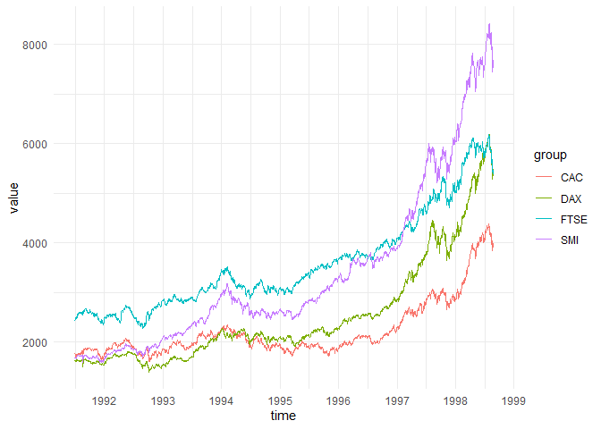
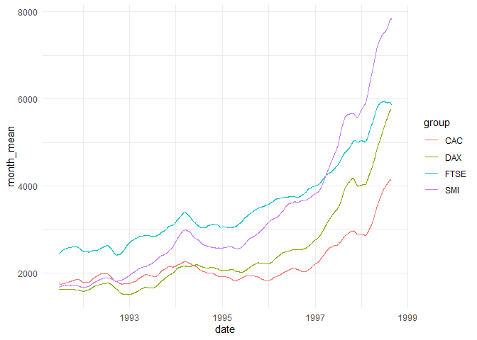
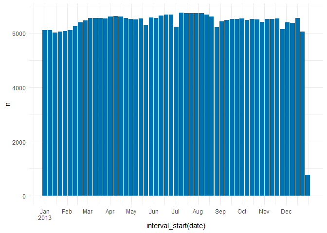
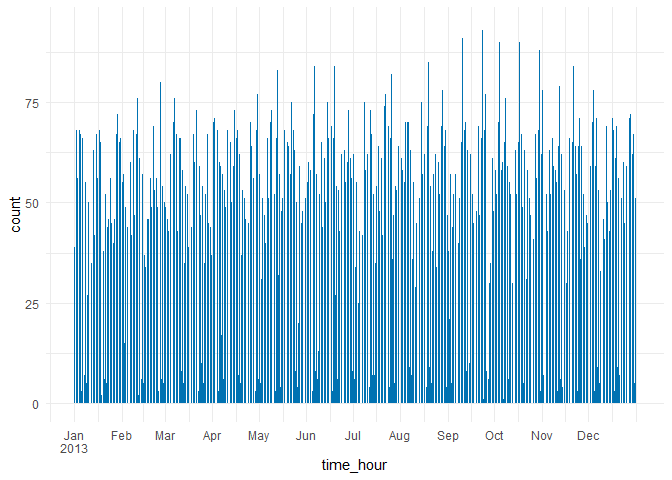

<!-- badges: start -->

[](https://github.com/NicChr/timeplyr/actions/workflows/R-CMD-check.yaml)
[](https://CRAN.R-project.org/package=timeplyr)
[](https://app.codecov.io/gh/NicChr/timeplyr)
<!-- badges: end -->

# timeplyr

# **Fast Tidy Tools for Date and Datetime Manipulation**

This package provides a set of functions to make working with date and
datetime data much easier!

While most time-based packages are designed to work with clean and
pre-aggregate data, timeplyr contains a set of tidy tools to complete,
expand and summarise both raw and aggregate date/datetime data.

Significant efforts have been made to ensure that grouped calculations
are fast and efficient thanks to the excellent functionality within the
collapse package.

## Installation

You can install and load `timeplyr` using the below code.

``` r
# CRAN version
install.packages("timeplyr")

# Development version
remotes::install_github("NicChr/timeplyr")
```

``` r
library(timeplyr)
library(tidyverse)
#> ── Attaching core tidyverse packages ──────────────────────── tidyverse 2.0.0 ──
#> ✔ dplyr     1.1.4     ✔ readr     2.1.6
#> ✔ forcats   1.0.1     ✔ stringr   1.6.0
#> ✔ ggplot2   4.0.1     ✔ tibble    3.3.0
#> ✔ lubridate 1.9.4     ✔ tidyr     1.3.1
#> ✔ purrr     1.2.0     
#> ── Conflicts ────────────────────────────────────────── tidyverse_conflicts() ──
#> ✖ dplyr::filter()       masks stats::filter()
#> ✖ dplyr::lag()          masks stats::lag()
#> ✖ ggplot2::resolution() masks timeplyr::resolution()
#> ℹ Use the conflicted package (<http://conflicted.r-lib.org/>) to force all conflicts to become errors
library(fastplyr)
#> 
#> Attaching package: 'fastplyr'
#> 
#> The following object is masked from 'package:dplyr':
#> 
#>     desc
#> 
#> The following objects are masked from 'package:tidyr':
#> 
#>     crossing, nesting
library(nycflights13)
library(lubridate)
```

# Basic examples

## Time arithmetic

``` r
start <- dmy("01-01-2000")

start |> 
  time_add("year")
#> [1] "2001-01-01"
```

Internally timeplyr makes use of custom `timespan` objects for various
time manipulations.

``` r
timespan("months"); timespan("1 month"); timespan(months(1))
#> <Timespan:months>
#> [1] 1
#> <Timespan:months>
#> [1] 1
#> <Timespan:months>
#> [1] 1

timespan("weeks", 1:10)
#> <Timespan:weeks>
#>  [1]  1  2  3  4  5  6  7  8  9 10
```

# Adding timespans

``` r

# Parsing 
start |> time_add("10 years"); start |> time_add("decade")
#> [1] "2010-01-01"
#> [1] "2010-01-01"

# Lubridate style timespans

start |> 
  time_add(years(1))
#> [1] "2001-01-01"

start |> time_add(dyears(1)); start |> time_add("31557600 seconds")
#> [1] "2000-12-31 06:00:00 UTC"
#> [1] "2000-12-31 06:00:00 UTC"

# timeplyr timespans

start |> 
  time_add(timespan("years", 1))
#> [1] "2001-01-01"
start |> 
  time_add(timespan("years", 0:10))
#>  [1] "2000-01-01" "2001-01-01" "2002-01-01" "2003-01-01" "2004-01-01"
#>  [6] "2005-01-01" "2006-01-01" "2007-01-01" "2008-01-01" "2009-01-01"
#> [11] "2010-01-01"
```

Time arithmetic involving days, weeks, months and years is equivalent to
using lubridate periods.

Any arithmetic involving units less than days, e.g. hours, minutes and
seconds, uses normal duration arithmetic in terms of how many seconds
have passed. This is equivalent to using lubridate durations.

``` r
# Clocks go back 1 hour at exactly 2 am
dst <- dmy_hms("26-10-2025 00:00:00", tz = "GB") |> time_add("hour")

# Below 2 are equivalent
dst |> 
  time_add(timespan("hours", 0:2))
#> [1] "2025-10-26 01:00:00 BST" "2025-10-26 01:00:00 GMT"
#> [3] "2025-10-26 02:00:00 GMT"
dst + dhours(0:2)
#> [1] "2025-10-26 01:00:00 BST" "2025-10-26 01:00:00 GMT"
#> [3] "2025-10-26 02:00:00 GMT"

# There is currently no timeplyr way to achieve the below result 
# 1 hour forward in clock time is actually 2 literal hours forward
dst + hours(0:2)
#> [1] "2025-10-26 01:00:00 BST" "2025-10-26 02:00:00 GMT"
#> [3] "2025-10-26 03:00:00 GMT"
```

Period-based hours, minutes and seconds are not as commonly used as
literal duration-based hours, minutes and seconds. Therefore timeplyr
tries to simplify things by removing the distinction and automatically
choosing periods for units larger than an hour and durations for units
smaller than a day without the user having to contemplate which to use.

``` r

# The lubridate and timeplyr equivalents

time_add(dst, "second"); dst + dseconds(1)
#> [1] "2025-10-26 01:00:01 BST"
#> [1] "2025-10-26 01:00:01 BST"
time_add(dst, "minute"); dst + dminutes(1)
#> [1] "2025-10-26 01:01:00 BST"
#> [1] "2025-10-26 01:01:00 BST"
time_add(dst, "hour"); dst + dhours(1)
#> [1] "2025-10-26 01:00:00 GMT"
#> [1] "2025-10-26 01:00:00 GMT"
time_add(dst, "day"); dst + days(1)
#> [1] "2025-10-27 01:00:00 GMT"
#> [1] "2025-10-27 01:00:00 GMT"
time_add(dst, "week"); dst + weeks(1)
#> [1] "2025-11-02 01:00:00 GMT"
#> [1] "2025-11-02 01:00:00 GMT"
time_add(dst, "month"); dst + months(1)
#> [1] "2025-11-26 01:00:00 GMT"
#> [1] "2025-11-26 01:00:00 GMT"
time_add(dst, "year"); dst + years(1)
#> [1] "2026-10-26 01:00:00 GMT"
#> [1] "2026-10-26 01:00:00 GMT"
```

# Time differences

Time differences are accurate and simple

``` r
start <- today()
end <- today() |>  time_add("decade")

time_diff(start, end, "years")
#> [1] 10

for (unit in .period_units){
    cat(unit, ":", time_diff(start, end, unit), "\n")
}
#> seconds : 315532800 
#> minutes : 5258880 
#> hours : 87648 
#> days : 3652 
#> weeks : 521.7143 
#> months : 120 
#> years : 10
```

# Months and years

When months and years are involved, timeplyr rolls impossible dates
forward by default which is different to lubridate which rolls backwards
by default

``` r
leap <- dmy("29-02-2020")

leap |> time_add("year"); leap |> add_with_rollback(years(1))
#> [1] "2021-03-01"
#> [1] "2021-02-28"
```

timeplyr handles month addition symmetrically by rolling backwards when
adding negative months

``` r
leap |> time_subtract("year")
#> [1] "2019-02-28"
```

This can all be controlled through the `roll_month` argument which has
options ‘xfirst’, ‘xlast’, ‘preday’, ‘postday’, ‘boundary’, ‘full’ and
‘NA’. The ‘xfirst’ and ‘xlast’ options are timeplyr specific and signify
crossed-first and crossed-last dates respectively. ‘xlast’ is set by
default package-wide.

The choice of rolling impossible dates can affect time difference
calculations.

``` r
# timeplyr 
leap_almost_one_year_old <- dmy("28-02-2021")
cat("timeplyr: ", time_diff(leap, leap_almost_one_year_old, "years"), "\n", 
    "lubridate: ", interval(leap, leap_almost_one_year_old) / years(1),
    sep = "")
#> timeplyr: 0.9972678
#> lubridate: 1
```

In the above example timeplyr lets leaplings be younger for an extra
day!

Monthly time differences in timeplyr are symmetric, regardless if
`x > y` or `x < y`

``` r
time_diff(leap, dmy("28-02-2021") + days(0:1), "years")
#> [1] 0.9972678 1.0000000
time_diff(leap, dmy("01-03-2019") - days(0:1), "years")
#> [1] -0.9972678 -1.0000000

# Not symmetric
interval(leap, dmy("28-02-2021") + days(0:1)) / years(1)
#> [1] 1.00000 1.00274
interval(leap, dmy("01-03-2019") - days(0:1)) / years(1)
#> [1] -0.9972678 -1.0000000
```

# Fixed time intervals

timeplyr makes use of its own custom time intervals. These are intervals
of a fixed width. For example, R Dates can be thought of as fixed
intervals of exactly 1 day width. In fact if you call `time_interval()`
on a Date vector this is exactly what you get.

``` r
time_interval(today())
#> <time_interval> [width:1D]
#> [1] [2026-02-10, +1D)
```

Going into more detail, timeplyr uses the ‘resolution’ of the object to
calculate the default width. Here, ‘resolution’ is defined as the
‘smallest timespan that differentiates two non-fractional instances in
time’.

For dates this is one day

``` r
resolution(today())
#> [1] 1
```

For date-times this is one second

``` r
resolution(now())
#> [1] 1
```

Another concept timeplyr introduces is ‘granularity’. This is defined as
‘the smallest common time difference’ which is a metric designed to
estimate the level of detail or frequency in which the dates are
recorded.

In the `flights` dataset, flight information is recorded every hour, or
within hourly intervals, meaning that the level of detail (or
granularity) within this dataset is hourly.

``` r
granularity(flights$time_hour)
#> <Timespan:hours>
#> [1] 1
```

To convert these implicit intervals into explicit intervals we can use
`time_cut_width` which places these hours into hourly intervals. It
places them by default into hourly intervals because it calls
`granularity()` by default.

``` r
time_cut_width(flights$time_hour) |> head()
#> <time_interval> [width:1h]
#> [1] [2013-01-01 05:00:00, +1h) [2013-01-01 05:00:00, +1h)
#> [3] [2013-01-01 05:00:00, +1h) [2013-01-01 05:00:00, +1h)
#> [5] [2013-01-01 06:00:00, +1h) [2013-01-01 05:00:00, +1h)

# Identically
time_cut_width(flights$time_hour, "1 hour") |> head()
#> <time_interval> [width:1h]
#> [1] [2013-01-01 05:00:00, +1h) [2013-01-01 05:00:00, +1h)
#> [3] [2013-01-01 05:00:00, +1h) [2013-01-01 05:00:00, +1h)
#> [5] [2013-01-01 06:00:00, +1h) [2013-01-01 05:00:00, +1h)
```

A common task is to places dates into larger time intervals,
e.g. converting hourly data into weekly data.

``` r
time_cut_width(flights$time_hour, "week") |> 
    interval_count()
#> # A tibble: 53 × 2
#>    interval                       n
#>    <tm_ntrvl>                 <int>
#>  1 [2013-01-01 05:00:00, +1W)  6099
#>  2 [2013-01-08 05:00:00, +1W)  6109
#>  3 [2013-01-15 05:00:00, +1W)  6018
#>  4 [2013-01-22 05:00:00, +1W)  6060
#>  5 [2013-01-29 05:00:00, +1W)  6072
#>  6 [2013-02-05 05:00:00, +1W)  6101
#>  7 [2013-02-12 05:00:00, +1W)  6255
#>  8 [2013-02-19 05:00:00, +1W)  6394
#>  9 [2013-02-26 05:00:00, +1W)  6460
#> 10 [2013-03-05 05:00:00, +1W)  6549
#> # ℹ 43 more rows
```

To get full weeks, simply utilise the `from` arg with `floor_date()`

``` r
time_cut_width(
    flights$time_hour, "week" , from = min(floor_date(flights$time_hour, "week"))
) |> 
  interval_count()
#> # A tibble: 53 × 2
#>    interval              n
#>    <tm_ntrvl>        <int>
#>  1 [2012-12-30, +1W)  4334
#>  2 [2013-01-06, +1W)  6118
#>  3 [2013-01-13, +1W)  6076
#>  4 [2013-01-20, +1W)  6012
#>  5 [2013-01-27, +1W)  6072
#>  6 [2013-02-03, +1W)  6089
#>  7 [2013-02-10, +1W)  6217
#>  8 [2013-02-17, +1W)  6349
#>  9 [2013-02-24, +1W)  6411
#> 10 [2013-03-03, +1W)  6551
#> # ℹ 43 more rows
```

# Interval helpers

Some common time interval functions

``` r
int <- time_cut_width(today() + days(0:13), timespan("weeks"))

interval_width(int)
#> <Timespan:weeks>
#> [1] 1
interval_range(int)
#> [1] "2026-02-10" "2026-02-24"
interval_start(int)
#>  [1] "2026-02-10" "2026-02-10" "2026-02-10" "2026-02-10" "2026-02-10"
#>  [6] "2026-02-10" "2026-02-10" "2026-02-17" "2026-02-17" "2026-02-17"
#> [11] "2026-02-17" "2026-02-17" "2026-02-17" "2026-02-17"
interval_end(int)
#>  [1] "2026-02-17" "2026-02-17" "2026-02-17" "2026-02-17" "2026-02-17"
#>  [6] "2026-02-17" "2026-02-17" "2026-02-24" "2026-02-24" "2026-02-24"
#> [11] "2026-02-24" "2026-02-24" "2026-02-24" "2026-02-24"
interval_count(int)
#> # A tibble: 2 × 2
#>   interval              n
#>   <tm_ntrvl>        <int>
#> 1 [2026-02-10, +1W)     7
#> 2 [2026-02-17, +1W)     7
```

# More detail

For the R veterans among you who would like more detail, `timespans` and
`time_intervals` are both lightweight S3 objects with some very basic
attributes, making them work quite fast in R.

`timespans` are simply numeric vectors with a time unit attribute.

`time_intervals` are the un-classed version of the time object they are
representing, along with a `timespan` attribute to record the interval
width, as well as an attribute to record the original class.

There are many methods written for both objects to ensure they work
seamlessly with most R functions.

``` r
timespan("days", 1:3) |> unclass()
#> [1] 1 2 3
#> attr(,"unit")
#> [1] "days"
time_interval(today()) |>  unclass()
#> [1] 20494
#> attr(,"timespan")
#> <Timespan:days>
#> [1] 1
#> attr(,"old_class")
#> [1] "Date"
```

## Convert `ts`, `mts`, `xts`, `zoo`and `timeSeries` objects using `ts_as_tbl`

``` r
eu_stock <- EuStockMarkets |>
  ts_as_tbl()
eu_stock
#> # A tibble: 7,440 × 3
#>    group  time value
#>    <chr> <dbl> <dbl>
#>  1 DAX   1991. 1629.
#>  2 DAX   1992. 1614.
#>  3 DAX   1992. 1607.
#>  4 DAX   1992. 1621.
#>  5 DAX   1992. 1618.
#>  6 DAX   1992. 1611.
#>  7 DAX   1992. 1631.
#>  8 DAX   1992. 1640.
#>  9 DAX   1992. 1635.
#> 10 DAX   1992. 1646.
#> # ℹ 7,430 more rows
```

## Easily plot time series using `time_ggplot`

``` r
eu_stock |>
  time_ggplot(time, value, group)
```

<!-- -->

For the next examples we use flights departing from New York City in
2013.

``` r
library(nycflights13)
library(lubridate)
flights <- flights |>
  mutate(date = as_date(time_hour))
```

## `time_by`

### Group your time variable by any time unit

``` r
flights_monthly <- flights |>
  select(date, arr_delay) |>
  time_by(date, "month")
#> ! Expressions will be optimised where possible.
#> 
#> Optimised expressions are independent from unoptimised ones and typical
#> data-masking rules may not apply
#> 
#> Run `fastplyr::fastplyr_disable_optimisations()` to disable optimisations
#> globally
#> 
#> Run `fastplyr::fastplyr_disable_informative_msgs()` to disable this and other
#> informative messages
#> This message is displayed once per session.

flights_monthly
#> # A tibble: 336,776 x 2
#> # Time:     date [12]
#> # Width:    month
#> # Range:    2013-01-01 -- 2014-01-01
#>    date              arr_delay
#>    <tm_ntrvl>            <dbl>
#>  1 [2013-01-01, +1M)        11
#>  2 [2013-01-01, +1M)        20
#>  3 [2013-01-01, +1M)        33
#>  4 [2013-01-01, +1M)       -18
#>  5 [2013-01-01, +1M)       -25
#>  6 [2013-01-01, +1M)        12
#>  7 [2013-01-01, +1M)        19
#>  8 [2013-01-01, +1M)       -14
#>  9 [2013-01-01, +1M)        -8
#> 10 [2013-01-01, +1M)         8
#> # ℹ 336,766 more rows
```

We can then use this to create a monthly summary of the number of
flights and average arrival delay

``` r
flights_monthly |>
  f_summarise(n = n(),
            mean_arr_delay = mean(arr_delay, na.rm = TRUE))
#> # A tibble: 12 × 3
#>    date                  n mean_arr_delay
#>    <tm_ntrvl>        <int>          <dbl>
#>  1 [2013-01-01, +1M) 27004          6.13 
#>  2 [2013-02-01, +1M) 24951          5.61 
#>  3 [2013-03-01, +1M) 28834          5.81 
#>  4 [2013-04-01, +1M) 28330         11.2  
#>  5 [2013-05-01, +1M) 28796          3.52 
#>  6 [2013-06-01, +1M) 28243         16.5  
#>  7 [2013-07-01, +1M) 29425         16.7  
#>  8 [2013-08-01, +1M) 29327          6.04 
#>  9 [2013-09-01, +1M) 27574         -4.02 
#> 10 [2013-10-01, +1M) 28889         -0.167
#> 11 [2013-11-01, +1M) 27268          0.461
#> 12 [2013-12-01, +1M) 28135         14.9
```

If the time unit is left unspecified, the `time` functions try to find
the highest time unit possible.

``` r
flights |>
  time_by(time_hour)
#> # A tibble: 336,776 x 20
#> # Time:     time_hour [6,936]
#> # Width:    hour
#> # Range:    2013-01-01 05:00:00 -- 2014-01-01
#>     year month   day dep_time sched_dep_time dep_delay arr_time sched_arr_time
#>    <int> <int> <int>    <int>          <int>     <dbl>    <int>          <int>
#>  1  2013     1     1      517            515         2      830            819
#>  2  2013     1     1      533            529         4      850            830
#>  3  2013     1     1      542            540         2      923            850
#>  4  2013     1     1      544            545        -1     1004           1022
#>  5  2013     1     1      554            600        -6      812            837
#>  6  2013     1     1      554            558        -4      740            728
#>  7  2013     1     1      555            600        -5      913            854
#>  8  2013     1     1      557            600        -3      709            723
#>  9  2013     1     1      557            600        -3      838            846
#> 10  2013     1     1      558            600        -2      753            745
#> # ℹ 336,766 more rows
#> # ℹ 12 more variables: arr_delay <dbl>, carrier <chr>, flight <int>,
#> #   tailnum <chr>, origin <chr>, dest <chr>, air_time <dbl>, distance <dbl>,
#> #   hour <dbl>, minute <dbl>, time_hour <tm_ntrvl>, date <date>
```

#### Check for missing gaps in time

``` r
missing_dates(flights$date) # No missing dates
#> Date of length 0
```

``` r
time_num_gaps(flights$time_hour) # Missing hours
#> [1] 1819
```

To check for regularity use `time_is_regular`

``` r
hours <- sort(flights$time_hour)
time_is_regular(hours, "hours")
#> [1] FALSE
time_is_regular(hours, "hours", allow_gaps = TRUE, allow_dups = TRUE)
#> [1] TRUE

# By-group
time_num_gaps(flights$time_hour, g = flights$origin)
#>  EWR  JFK  LGA 
#> 2489 1820 2468
time_is_regular(flights$time_hour, g = flights$origin)
#>   EWR   JFK   LGA 
#> FALSE FALSE FALSE
```

# Grouped rolling time functions

## By-group rolling mean over the last 3 calendar months

``` r
eu_stock <- eu_stock |>
  mutate(date = date_decimal(time))

eu_stock |>
    mutate(month_mean = time_roll_mean(value, window = months(3), 
                                       time = date, 
                                       g = group)) |>
    time_ggplot(date, month_mean, group)
```

<!-- -->

## By-group rolling (locf) NA fill

``` r
# Prerequisite: Create Time series with missing values
x <- ts(c(NA, 3, 4, NA, 6, NA, NA, 8))
g <- cheapr::seq_id(c(3, 5)) # Two groups of size 3 + 5

roll_na_fill(x) # Simple locf fill
#> Time Series:
#> Start = 1 
#> End = 8 
#> Frequency = 1 
#> [1] NA  3  4  4  6  6  6  8
roll_na_fill(x, fill_limit = 1) # Fill up to 1 NA
#> Time Series:
#> Start = 1 
#> End = 8 
#> Frequency = 1 
#> [1] NA  3  4  4  6  6 NA  8

roll_na_fill(x, g = g) # Very efficient on large data too
#> Time Series:
#> Start = 1 
#> End = 8 
#> Frequency = 1 
#> [1] NA  3  4 NA  6  6  6  8
```

## `year_month` and `year_quarter`

timeplyr has its own lightweight ‘yearmonth’ and \`yearquarter’ classes
inspired by the excellent ‘zoo’ and ‘tsibble’ packages.

``` r
today <- today()
year_month(today)
#> [1] "2026 Feb"
```

The underlying data for a `year_month` is the number of months since 1
January 1970 (epoch).

``` r
unclass(year_month("1970-01-01"))
#> [1] 0
unclass(year_month("1971-01-01"))
#> [1] 12
```

To create a sequence of ‘year_months’, one can use base arithmetic

``` r
year_month(today) + 0:12
#>  [1] "2026 Feb" "2026 Mar" "2026 Apr" "2026 May" "2026 Jun" "2026 Jul"
#>  [7] "2026 Aug" "2026 Sep" "2026 Oct" "2026 Nov" "2026 Dec" "2027 Jan"
#> [13] "2027 Feb"
year_quarter(today) + 0:4
#> [1] "2026 Q1" "2026 Q2" "2026 Q3" "2026 Q4" "2027 Q1"
```

## `time_elapsed()`

Let’s look at the time between consecutive flights for a specific flight
number

``` r
set.seed(42)
flight_201 <- flights |>
  f_distinct(time_hour, flight) |>
  f_filter(flight %in% sample(flight, size = 1)) |>
  f_arrange(time_hour)

tail(sort(table(time_elapsed(flight_201$time_hour, "hours"))))
#> 
#>  23  25  48   6  18  24 
#>   2   3   4  33  34 218
```

Flight 201 seems to depart mostly consistently every 24 hours

We can efficiently do the same for all flight numbers

``` r
# We use fdistinct with sort as it's much faster and simpler to write
all_flights <- flights |>
  f_distinct(flight, time_hour, .sort = TRUE)
all_flights <- all_flights |>
  mutate(elapsed = time_elapsed(time_hour, g = flight, fill = 0))

# Flight numbers with largest relative deviation in time between flights
all_flights |>
  tidy_quantiles(elapsed, .by = flight, pivot = "wide") |>
  mutate(relative_iqr = p75 / p25) |>
  f_arrange(desc(relative_iqr))
#> # A tibble: 3,844 × 7
#>    flight    p0   p25   p50   p75  p100 relative_iqr
#>     <int> <dbl> <dbl> <dbl> <dbl> <dbl>        <dbl>
#>  1   3664     0    12    24 3252   6480         271 
#>  2   5709     0    12    24 3080.  6137         257.
#>  3    513     0    12    24 2250.  4477         188.
#>  4   3364     0    12    24 2204.  4385         184.
#>  5   1578     0    24    48 4182.  8317         174.
#>  6   1830     0     1   167  168    168         168 
#>  7   1569     0    18   105 2705   2787         150.
#>  8   1997     0    18    96 2158   8128         120.
#>  9    663     0    24   119 2604   3433         108.
#> 10    233     0     7    14  718   1422         103.
#> # ℹ 3,834 more rows
```

`time_seq_id()` allows us to create unique IDs for regular sequences A
new ID is created every time there is a gap in the sequence

``` r
flights |>
  f_select(time_hour) |>
  f_arrange(time_hour) |>
  mutate(time_id = time_seq_id(time_hour)) |>
  f_filter(time_id != lag(time_id)) |>
  f_count(hour(time_hour))
#> # A tibble: 2 × 2
#>   `hour(time_hour)`     n
#>               <int> <int>
#> 1                 1     1
#> 2                 5   364
```

We can see that the gaps typically occur at 11pm and the sequence
resumes at 5am.

### Other convenience functions are included below

## `calendar()`

#### Easily join common date information to your data

``` r
flights_calendar <- flights |>
    f_select(time_hour) |>
    reframe(calendar(time_hour))
```

Now that gaps in time have been filled and we have joined our date
table, it is easy to count by any time dimension we like

``` r
flights_calendar |> 
  f_count(isoyear, isoweek)
#> # A tibble: 53 × 3
#>    isoyear isoweek     n
#>      <int>   <int> <int>
#>  1    2013       1  5166
#>  2    2013       2  6114
#>  3    2013       3  6034
#>  4    2013       4  6049
#>  5    2013       5  6063
#>  6    2013       6  6104
#>  7    2013       7  6236
#>  8    2013       8  6381
#>  9    2013       9  6444
#> 10    2013      10  6546
#> # ℹ 43 more rows
flights_calendar |> 
  f_count(isoweek = iso_week(time))
#> # A tibble: 53 × 2
#>    isoweek      n
#>    <chr>    <int>
#>  1 2013-W01  5166
#>  2 2013-W02  6114
#>  3 2013-W03  6034
#>  4 2013-W04  6049
#>  5 2013-W05  6063
#>  6 2013-W06  6104
#>  7 2013-W07  6236
#>  8 2013-W08  6381
#>  9 2013-W09  6444
#> 10 2013-W10  6546
#> # ℹ 43 more rows
flights_calendar |> 
  f_count(month_l)
#> # A tibble: 12 × 2
#>    month_l     n
#>    <ord>   <int>
#>  1 Jan     27004
#>  2 Feb     24951
#>  3 Mar     28834
#>  4 Apr     28330
#>  5 May     28796
#>  6 Jun     28243
#>  7 Jul     29425
#>  8 Aug     29327
#>  9 Sep     27574
#> 10 Oct     28889
#> 11 Nov     27268
#> 12 Dec     28135
```

## `time_seq()`

A lubridate version of `seq()` for dates and datetimes

``` r
start <- dmy(31012020)
end <- start + years(1)
seq(start, end, by = "month") # Base R version
#>  [1] "2020-01-31" "2020-03-02" "2020-03-31" "2020-05-01" "2020-05-31"
#>  [6] "2020-07-01" "2020-07-31" "2020-08-31" "2020-10-01" "2020-10-31"
#> [11] "2020-12-01" "2020-12-31" "2021-01-31"
time_seq(start, end, "month") # lubridate version 
#>  [1] "2020-01-31" "2020-03-01" "2020-03-31" "2020-05-01" "2020-05-31"
#>  [6] "2020-07-01" "2020-07-31" "2020-08-31" "2020-10-01" "2020-10-31"
#> [11] "2020-12-01" "2020-12-31" "2021-01-31"
```

`time_seq()` doesn’t mind mixing dates and datetimes

``` r
time_seq(start, as_datetime(end), "2 weeks")
#>  [1] "2020-01-31 UTC" "2020-02-14 UTC" "2020-02-28 UTC" "2020-03-13 UTC"
#>  [5] "2020-03-27 UTC" "2020-04-10 UTC" "2020-04-24 UTC" "2020-05-08 UTC"
#>  [9] "2020-05-22 UTC" "2020-06-05 UTC" "2020-06-19 UTC" "2020-07-03 UTC"
#> [13] "2020-07-17 UTC" "2020-07-31 UTC" "2020-08-14 UTC" "2020-08-28 UTC"
#> [17] "2020-09-11 UTC" "2020-09-25 UTC" "2020-10-09 UTC" "2020-10-23 UTC"
#> [21] "2020-11-06 UTC" "2020-11-20 UTC" "2020-12-04 UTC" "2020-12-18 UTC"
#> [25] "2021-01-01 UTC" "2021-01-15 UTC" "2021-01-29 UTC"
```

It is also vectorised

``` r
# 3 sequences
time_seq(from = start, 
         to = end, 
         timespan("months", 1:3))
#>  [1] "2020-01-31" "2020-03-01" "2020-03-31" "2020-05-01" "2020-05-31"
#>  [6] "2020-07-01" "2020-07-31" "2020-08-31" "2020-10-01" "2020-10-31"
#> [11] "2020-12-01" "2020-12-31" "2021-01-31" "2020-01-31" "2020-03-31"
#> [16] "2020-05-31" "2020-07-31" "2020-10-01" "2020-12-01" "2021-01-31"
#> [21] "2020-01-31" "2020-05-01" "2020-07-31" "2020-10-31" "2021-01-31"
# Equivalent to 
c(time_seq(start, end, "month"),
  time_seq(start, end, "2 months"),
  time_seq(start, end, "3 months"))
#>  [1] "2020-01-31" "2020-03-01" "2020-03-31" "2020-05-01" "2020-05-31"
#>  [6] "2020-07-01" "2020-07-31" "2020-08-31" "2020-10-01" "2020-10-31"
#> [11] "2020-12-01" "2020-12-31" "2021-01-31" "2020-01-31" "2020-03-31"
#> [16] "2020-05-31" "2020-07-31" "2020-10-01" "2020-12-01" "2021-01-31"
#> [21] "2020-01-31" "2020-05-01" "2020-07-31" "2020-10-31" "2021-01-31"
```

## `time_seq_sizes()`

Vectorised function that calculates time sequence lengths

``` r
seq_lengths <- time_seq_sizes(start, start + days(c(1, 10, 20)), 
                              timespan("days", c(1, 5, 10)))
seq_lengths
#> [1] 2 3 3

# Use length.out if you know the sequence lengths
time_seq(length = seq_lengths, from = start, time = timespan("days", c(1, 5, 10)))
#> [1] "2020-01-31" "2020-02-01" "2020-01-31" "2020-02-05" "2020-02-10"
#> [6] "2020-01-31" "2020-02-10" "2020-02-20"
```

## `iso_week()`

Simple function to get formatted ISO weeks.

``` r
iso_week(today())
#> [1] "2026-W07"
iso_week(today(), day = TRUE)
#> [1] "2026-W07-2"
iso_week(today(), year = FALSE)
#> [1] "W07"
```

## `time_cut()`

Create pretty time axes using `time_breaks()`

``` r
times <- flights$time_hour
dates <- flights$date

date_breaks <- time_breaks(dates, n = 12)
time_breaks <- time_breaks(times, n = 12, time_floor = TRUE)

weekly_data <- flights |>
    time_by(date, "week",
            .name = "date") |>
    f_count()
weekly_data |>
  ggplot(aes(x = interval_start(date), y = n)) + 
  geom_bar(stat = "identity", fill = "#0072B2") + 
  scale_x_date(breaks = date_breaks, labels = scales::label_date_short()) 
```

<!-- -->

``` r

flights |>
  ggplot(aes(x = time_hour)) + 
  geom_bar(fill = "#0072B2") + 
  scale_x_datetime(breaks = time_breaks, labels = scales::label_date_short())
```

<!-- -->
