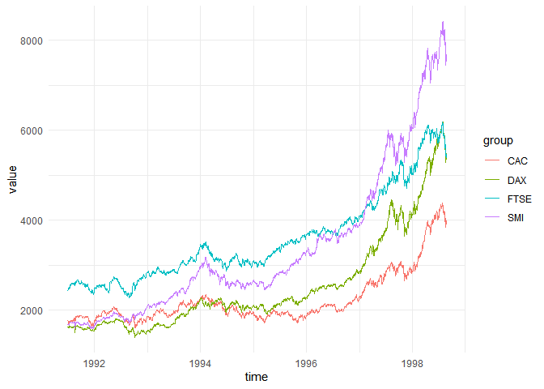
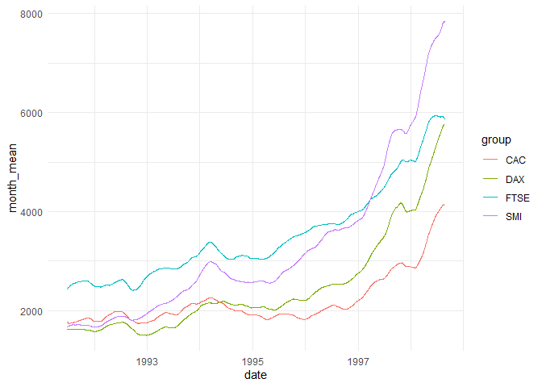

<!-- badges: start -->

[](https://github.com/NicChr/timeplyr/actions/workflows/R-CMD-check.yaml)
[](https://CRAN.R-project.org/package=timeplyr)
<!-- badges: end -->

# timeplyr

# **Fast Tidy Tools for Date and Datetime Manipulation**

This package provides a set of functions to make working with date and
datetime data much easier!

While most time-based packages are designed to work with clean and
pre-aggregate data, timeplyr contains a set of tidy tools to complete,
expand and summarise both raw and aggregate date/datetime data.

Significant efforts have been made to ensure that grouped calculations
are fast and efficient thanks to the excellent functionality within the
[collapse](https://sebkrantz.github.io/collapse/reference/collapse-package.html)
package.

## Installation

You can install and load `timeplyr` using the below code.

``` r
# CRAN version
install.packages("timeplyr")

# Development version
remotes::install_github("NicChr/timeplyr")
```

``` r
library(timeplyr)
```

# Basic examples

## Convert `ts`, `mts`, `xts`, `zoo`and `timeSeries` objects using `ts_as_tibble`

``` r
library(tidyverse)
#> ── Attaching core tidyverse packages ──────────────────────── tidyverse 2.0.0 ──
#> ✔ dplyr     1.1.4     ✔ readr     2.1.4
#> ✔ forcats   1.0.0     ✔ stringr   1.5.0
#> ✔ ggplot2   3.4.3     ✔ tibble    3.2.1
#> ✔ lubridate 1.9.2     ✔ tidyr     1.3.0
#> ✔ purrr     1.0.1     
#> ── Conflicts ────────────────────────────────────────── tidyverse_conflicts() ──
#> ✖ dplyr::desc()   masks timeplyr::desc()
#> ✖ dplyr::filter() masks stats::filter()
#> ✖ dplyr::lag()    masks stats::lag()
#> ✖ dplyr::top_n()  masks timeplyr::top_n()
#> ℹ Use the conflicted package (<http://conflicted.r-lib.org/>) to force all conflicts to become errors
eu_stock <- EuStockMarkets %>%
  ts_as_tibble()
eu_stock
#> # A tibble: 7,440 × 3
#>    group  time value
#>    <chr> <dbl> <dbl>
#>  1 DAX   1991. 1629.
#>  2 DAX   1992. 1614.
#>  3 DAX   1992. 1607.
#>  4 DAX   1992. 1621.
#>  5 DAX   1992. 1618.
#>  6 DAX   1992. 1611.
#>  7 DAX   1992. 1631.
#>  8 DAX   1992. 1640.
#>  9 DAX   1992. 1635.
#> 10 DAX   1992. 1646.
#> # ℹ 7,430 more rows
```

## Easily plot time series using `time_ggplot`

``` r
eu_stock %>%
  time_ggplot(time, value, group)
```

<!-- -->

For the next examples we use flights departing from New York City in
2013.

``` r
library(nycflights13)
library(lubridate)
flights <- flights %>%
  mutate(date = as_date(time_hour))
```

## `time_by`

### Group your time variable by any time unit

``` r
flights_monthly <- flights %>%
  select(date, arr_delay) %>%
  time_by(date, "month")

flights_monthly
#> # A tibble: 336,776 x 2
#> # Time:     date [12]
#> # By:       month
#> # Span:     2013-01-01 - 2013-12-31
#>    date       arr_delay
#>    <date>         <dbl>
#>  1 2013-01-01        11
#>  2 2013-01-01        20
#>  3 2013-01-01        33
#>  4 2013-01-01       -18
#>  5 2013-01-01       -25
#>  6 2013-01-01        12
#>  7 2013-01-01        19
#>  8 2013-01-01       -14
#>  9 2013-01-01        -8
#> 10 2013-01-01         8
#> # ℹ 336,766 more rows
```

We can then use this to create a monthly summary of the number of
flights and average arrival delay

``` r
flights_monthly %>%
  summarise(n = n(),
            mean_arr_delay = mean(arr_delay, na.rm = TRUE))
#> # A tibble: 12 × 3
#>    date           n mean_arr_delay
#>    <date>     <int>          <dbl>
#>  1 2013-01-01 27004          6.13 
#>  2 2013-02-01 24951          5.61 
#>  3 2013-03-01 28834          5.81 
#>  4 2013-04-01 28330         11.2  
#>  5 2013-05-01 28796          3.52 
#>  6 2013-06-01 28243         16.5  
#>  7 2013-07-01 29425         16.7  
#>  8 2013-08-01 29327          6.04 
#>  9 2013-09-01 27574         -4.02 
#> 10 2013-10-01 28889         -0.167
#> 11 2013-11-01 27268          0.461
#> 12 2013-12-01 28135         14.9
```

If the time unit is left unspecified, the `time` functions try to find
the highest time unit possible.

``` r
flights %>%
  time_by(time_hour)
#> # A tibble: 336,776 x 20
#> # Time:     time_hour [6,936]
#> # By:       hour
#> # Span:     2013-01-01 05:00:00 - 2013-12-31 23:00:00
#>     year month   day dep_time sched_dep_time dep_delay arr_time sched_arr_time
#>    <int> <int> <int>    <int>          <int>     <dbl>    <int>          <int>
#>  1  2013     1     1      517            515         2      830            819
#>  2  2013     1     1      533            529         4      850            830
#>  3  2013     1     1      542            540         2      923            850
#>  4  2013     1     1      544            545        -1     1004           1022
#>  5  2013     1     1      554            600        -6      812            837
#>  6  2013     1     1      554            558        -4      740            728
#>  7  2013     1     1      555            600        -5      913            854
#>  8  2013     1     1      557            600        -3      709            723
#>  9  2013     1     1      557            600        -3      838            846
#> 10  2013     1     1      558            600        -2      753            745
#> # ℹ 336,766 more rows
#> # ℹ 12 more variables: arr_delay <dbl>, carrier <chr>, flight <int>,
#> #   tailnum <chr>, origin <chr>, dest <chr>, air_time <dbl>, distance <dbl>,
#> #   hour <dbl>, minute <dbl>, time_hour <dttm>, date <date>
```

## `time_complete()`

### Complete missing gaps in time

``` r
flights %>%
  count(time_hour) %>%
  time_complete(time_hour)
#> Assuming a time granularity of 1 hour(s)
#> # A tibble: 8,755 × 2
#>    time_hour               n
#>    <dttm>              <int>
#>  1 2013-01-01 05:00:00     6
#>  2 2013-01-01 06:00:00    52
#>  3 2013-01-01 07:00:00    49
#>  4 2013-01-01 08:00:00    58
#>  5 2013-01-01 09:00:00    56
#>  6 2013-01-01 10:00:00    39
#>  7 2013-01-01 11:00:00    37
#>  8 2013-01-01 12:00:00    56
#>  9 2013-01-01 13:00:00    54
#> 10 2013-01-01 14:00:00    48
#> # ℹ 8,745 more rows
```

## `time_count()`

### Count by any time unit

``` r
flights %>%
  time_count(date, time_by = "quarter")
#> # A tibble: 4 × 2
#>   date           n
#>   <date>     <int>
#> 1 2013-01-01 80789
#> 2 2013-04-01 85369
#> 3 2013-07-01 86326
#> 4 2013-10-01 84292
```

### We can also make use of timeplyr time intervals

``` r
quarters <- time_aggregate(flights$date, time_by = "quarter", as_interval = TRUE)
interval_count(quarters)
#> # A tibble: 4 × 2
#>                   interval     n
#>                  <tm_intv> <int>
#> 1 [2013-01-01, 2013-04-01) 80789
#> 2 [2013-04-01, 2013-07-01) 85369
#> 3 [2013-07-01, 2013-10-01) 86326
#> 4 [2013-10-01, 2014-01-01) 84292

# Or simply
flights %>%
  time_count(date, time_by = "quarter", as_interval = TRUE)
#> # A tibble: 4 × 2
#>                       date     n
#>                  <tm_intv> <int>
#> 1 [2013-01-01, 2013-04-01) 80789
#> 2 [2013-04-01, 2013-07-01) 85369
#> 3 [2013-07-01, 2013-10-01) 86326
#> 4 [2013-10-01, 2014-01-01) 84292
```

#### Ensure full weeks/months/years by using `time_floor = TRUE`

``` r
start <- dmy("17-Jan-2013")
flights %>%
  time_count(date,
             time_by = "week", from = start, time_floor = TRUE)
#> # A tibble: 52 × 2
#>    date           n
#>    <date>     <int>
#>  1 2013-01-14  3311
#>  2 2013-01-21  6049
#>  3 2013-01-28  6063
#>  4 2013-02-04  6104
#>  5 2013-02-11  6236
#>  6 2013-02-18  6381
#>  7 2013-02-25  6444
#>  8 2013-03-04  6546
#>  9 2013-03-11  6555
#> 10 2013-03-18  6547
#> # ℹ 42 more rows
flights %>%
  time_count(date,
             time_by = "month", from = start, time_floor = TRUE)
#> # A tibble: 13 × 2
#>    date           n
#>    <date>     <int>
#>  1 2013-01-01 13001
#>  2 2013-02-01 24951
#>  3 2013-03-01 28834
#>  4 2013-04-01 28330
#>  5 2013-05-01 28796
#>  6 2013-06-01 28243
#>  7 2013-07-01 29425
#>  8 2013-08-01 29327
#>  9 2013-09-01 27574
#> 10 2013-10-01 28889
#> 11 2013-11-01 27268
#> 12 2013-12-01 28135
#> 13 NA         14003
```

#### Check for missing gaps in time

``` r
missing_dates(flights$date) # No missing dates
#> Date of length 0
```

``` r
time_num_gaps(flights$time_hour, time_by = "hours") # Missing hours
#> [1] 1819
```

To check for regularity use `time_is_regular`

``` r
hours <- sort(flights$time_hour)
time_is_regular(hours, time_by = "hours")
#> [1] TRUE
time_is_regular(hours, time_by = "hours", allow_gaps = FALSE)
#> [1] FALSE
time_is_regular(hours, time_by = "hours", allow_dups = FALSE)
#> [1] FALSE

# By-group
time_num_gaps(flights$time_hour, g = flights$origin, time_by = "hours")
#>  EWR  JFK  LGA 
#> 2489 1820 2468
time_is_regular(flights$time_hour, g = flights$origin, time_by = "hours")
#>   EWR   JFK   LGA 
#> FALSE FALSE FALSE
```

## `time_expand()`

Here we create monthly sequences for each destination that accounts for
the start and end dates of each destination

``` r
flights %>%
  group_by(dest) %>%
  time_expand(date, time_by = "month") %>%
  summarise(n = n(), start = min(date), end = max(date))
#> # A tibble: 105 × 4
#>    dest      n start      end       
#>    <chr> <int> <date>     <date>    
#>  1 ABQ       9 2013-04-22 2013-12-22
#>  2 ACK       6 2013-05-16 2013-10-16
#>  3 ALB      12 2013-01-01 2013-12-01
#>  4 ANC       2 2013-07-06 2013-08-06
#>  5 ATL      12 2013-01-01 2013-12-01
#>  6 AUS      12 2013-01-01 2013-12-01
#>  7 AVL      12 2013-01-01 2013-12-01
#>  8 BDL      12 2013-01-01 2013-12-01
#>  9 BGR      10 2013-03-02 2013-12-02
#> 10 BHM      12 2013-01-02 2013-12-02
#> # ℹ 95 more rows
```

To create the same grid of months for each dest, we can do the following

``` r
flights %>%
  time_expand(date, dest, time_by = "month") %>%
  summarise(n = n(), start = min(date), end = max(date), .by = dest)
#> # A tibble: 105 × 4
#>    dest      n start      end       
#>    <chr> <int> <date>     <date>    
#>  1 ABQ      12 2013-01-01 2013-12-01
#>  2 ACK      12 2013-01-01 2013-12-01
#>  3 ALB      12 2013-01-01 2013-12-01
#>  4 ANC      12 2013-01-01 2013-12-01
#>  5 ATL      12 2013-01-01 2013-12-01
#>  6 AUS      12 2013-01-01 2013-12-01
#>  7 AVL      12 2013-01-01 2013-12-01
#>  8 BDL      12 2013-01-01 2013-12-01
#>  9 BGR      12 2013-01-01 2013-12-01
#> 10 BHM      12 2013-01-01 2013-12-01
#> # ℹ 95 more rows
```

The ability to create time sequences by group is one of the most
powerful features of timeplyr.

## `time_summarise()`

We can shortcut the time aggregation and then additional summary by
using `time_summarise()`.

``` r
flights %>%
  time_summarise(date, # Time variable 
                 across(c(arr_time, dep_time), # By-month summaries
                        ~ mean(.x, na.rm = TRUE)),
                 time_by = "month",   
                 time_floor = TRUE, # Full months
                 as_interval = TRUE) # Time interval
#> # A tibble: 12 × 3
#>                        date arr_time dep_time
#>                   <tm_intv>    <dbl>    <dbl>
#>  1 [2013-01-01, 2013-02-01)    1523.    1347.
#>  2 [2013-02-01, 2013-03-01)    1522.    1348.
#>  3 [2013-03-01, 2013-04-01)    1510.    1359.
#>  4 [2013-04-01, 2013-05-01)    1501.    1353.
#>  5 [2013-05-01, 2013-06-01)    1503.    1351.
#>  6 [2013-06-01, 2013-07-01)    1468.    1351.
#>  7 [2013-07-01, 2013-08-01)    1456.    1353.
#>  8 [2013-08-01, 2013-09-01)    1495.    1350.
#>  9 [2013-09-01, 2013-10-01)    1504.    1334.
#> 10 [2013-10-01, 2013-11-01)    1520.    1340.
#> 11 [2013-11-01, 2013-12-01)    1523.    1344.
#> 12 [2013-12-01, 2014-01-01)    1505.    1357.
```

# Grouped rolling time functions

## By-group rolling mean over the last 3 calendar months

``` r
eu_stock <- eu_stock %>%
  mutate(date = date_decimal(time))

eu_stock %>%
    mutate(month_mean = time_roll_mean(value, window = months(3), 
                                       time = date, 
                                       g = group)) %>%
    time_ggplot(date, month_mean, group)
```

<!-- -->

## By-group rolling (locf) NA fill

``` r
# Prerequisite: Create Time series with missing values
x <- ts(c(NA, 3, 4, NA, 6, NA, NA, 8))
g <- seq_id(c(3, 5)) # Two groups of size 3 + 5

.roll_na_fill(x) # Simple locf fill
#> Time Series:
#> Start = 1 
#> End = 8 
#> Frequency = 1 
#> [1] NA  3  4  4  6  6  6  8
roll_na_fill(x, fill_limit = 1) # Fill up to 1 NA
#> Time Series:
#> Start = 1 
#> End = 8 
#> Frequency = 1 
#> [1] NA  3  4  4  6  6 NA  8

roll_na_fill(x, g = g) # Very efficient on large data too
#> Time Series:
#> Start = 1 
#> End = 8 
#> Frequency = 1 
#> [1] NA  3  4 NA  6  6  6  8
```

## `year_month` and `year_quarter`

timeplyr has its own lightweight ‘yearmonth’ and \`yearquarter’ classes
inspired by the excellent ‘zoo’ and ‘tsibble’ packages.

``` r
today <- today()
year_month(today)
#> [1] "2024 Jan"
```

The underlying data for a `year_month` is the number of months since 1
January 1970 (epoch).

``` r
unclass(year_month("1970-01-01"))
#> [1] 0
unclass(year_month("1971-01-01"))
#> [1] 12
```

To create a sequence of ‘year_months’, one can use base arithmetic

``` r
year_month(today) + 0:12
#>  [1] "2024 Jan" "2024 Feb" "2024 Mar" "2024 Apr" "2024 May" "2024 Jun"
#>  [7] "2024 Jul" "2024 Aug" "2024 Sep" "2024 Oct" "2024 Nov" "2024 Dec"
#> [13] "2025 Jan"
year_quarter(today) + 0:4
#> [1] "2024 Q1" "2024 Q2" "2024 Q3" "2024 Q4" "2025 Q1"
```

## `time_elapsed()`

Let’s look at the time between consecutive flights for a specific flight
number

``` r
set.seed(42)
flight_201 <- flights %>%
  distinct(time_hour, flight) %>%
  filter(flight %in% sample(flight, size = 1)) %>%
  arrange(time_hour)

top_n_tbl(time_elapsed(flight_201$time_hour, "hours"))
#> # A tibble: 5 × 2
#>   value     n
#>   <dbl> <int>
#> 1    24   218
#> 2    18    34
#> 3     6    33
#> 4    48     4
#> 5    25     3
```

Flight 201 seems to depart mostly consistently every 24 hours

We can efficiently do the same for all flight numbers

``` r
# We use fdistinct with sort as it's much faster and simpler to write
all_flights <- flights %>%
  fdistinct(flight, time_hour, sort = TRUE)
all_flights <- all_flights %>%
  mutate(elapsed = time_elapsed(time_hour, g = flight, fill = 0))
#> Assuming a time granularity of 1 hour(s)

# Flight numbers with largest relative deviation in time between flights
all_flights %>%
  q_summarise(elapsed, .by = flight) %>%
  mutate(relative_iqr = p75 / p25) %>%
  arrange(desc(relative_iqr))
#>       flight    p0   p25   p50    p75  p100 relative_iqr
#>        <int> <num> <num> <num>  <num> <num>        <num>
#>    1:   3664     0    12    24 3252.0  6480     271.0000
#>    2:   5709     0    12    24 3080.5  6137     256.7083
#>    3:    513     0    12    24 2250.5  4477     187.5417
#>    4:   3364     0    12    24 2204.5  4385     183.7083
#>    5:   1578     0    24    48 4182.5  8317     174.2708
#>   ---                                                   
#> 3840:   6114     0     0     0    0.0     0          NaN
#> 3841:   6140     0     0     0    0.0     0          NaN
#> 3842:   6165     0     0     0    0.0     0          NaN
#> 3843:   6171     0     0     0    0.0     0          NaN
#> 3844:   8500     0     0     0    0.0     0          NaN
```

`time_seq_id()` allows us to create unique IDs for regular sequences A
new ID is created every time there is a gap in the sequence

``` r
flights %>%
  select(time_hour) %>%
  arrange(time_hour) %>%
  mutate(time_id = time_seq_id(time_hour)) %>%
  filter(time_id != lag(time_id)) %>%
  count(hour(time_hour))
#> Assuming a time granularity of 1 hour(s)
#> # A tibble: 2 × 2
#>   `hour(time_hour)`     n
#>               <int> <int>
#> 1                 1     1
#> 2                 5   364
```

We can see that the gaps typically occur at 11pm and the sequence
resumes at 5am.

### Other convenience functions are included below

## `add_calendar()`

#### Easily join common date information to your data

``` r
flights_calendar <- flights %>%
  select(time_hour) %>%
  add_calendar(time_hour)
```

Now that gaps in time have been filled and we have joined our date
table, it is easy to count by any time dimension we like

``` r
flights_calendar %>% 
  fcount(isoyear, isoweek)
#> # A tibble: 53 × 3
#>    isoyear isoweek     n
#>      <int>   <int> <int>
#>  1    2013       1  5166
#>  2    2013       2  6114
#>  3    2013       3  6034
#>  4    2013       4  6049
#>  5    2013       5  6063
#>  6    2013       6  6104
#>  7    2013       7  6236
#>  8    2013       8  6381
#>  9    2013       9  6444
#> 10    2013      10  6546
#> # ℹ 43 more rows
flights_calendar %>% 
  fcount(isoweek = iso_week(time_hour))
#> # A tibble: 53 × 2
#>    isoweek      n
#>    <chr>    <int>
#>  1 2013-W01  5166
#>  2 2013-W02  6114
#>  3 2013-W03  6034
#>  4 2013-W04  6049
#>  5 2013-W05  6063
#>  6 2013-W06  6104
#>  7 2013-W07  6236
#>  8 2013-W08  6381
#>  9 2013-W09  6444
#> 10 2013-W10  6546
#> # ℹ 43 more rows
flights_calendar %>% 
  fcount(month_l)
#> # A tibble: 12 × 2
#>    month_l     n
#>    <ord>   <int>
#>  1 Jan     27004
#>  2 Feb     24951
#>  3 Mar     28834
#>  4 Apr     28330
#>  5 May     28796
#>  6 Jun     28243
#>  7 Jul     29425
#>  8 Aug     29327
#>  9 Sep     27574
#> 10 Oct     28889
#> 11 Nov     27268
#> 12 Dec     28135
```

## `.time_units`

See a list of available time units

``` r
.time_units
#>  [1] "picoseconds"  "nanoseconds"  "microseconds" "milliseconds" "seconds"     
#>  [6] "minutes"      "hours"        "days"         "weeks"        "months"      
#> [11] "years"        "fortnights"   "quarters"     "semesters"    "olympiads"   
#> [16] "lustrums"     "decades"      "indictions"   "scores"       "centuries"   
#> [21] "milleniums"
```

## `age_years()`

Calculate ages (years) accurately

``` r
age_years(dmy("28-02-2000"))
#> [1] 23
```

## `time_seq()`

A lubridate version of `seq()` for dates and datetimes

``` r
start <- dmy(31012020)
end <- start + years(1)
seq(start, end, by = "month") # Base R version
#>  [1] "2020-01-31" "2020-03-02" "2020-03-31" "2020-05-01" "2020-05-31"
#>  [6] "2020-07-01" "2020-07-31" "2020-08-31" "2020-10-01" "2020-10-31"
#> [11] "2020-12-01" "2020-12-31" "2021-01-31"
time_seq(start, end, time_by = "month") # lubridate version
#>  [1] "2020-01-31" "2020-02-29" "2020-03-31" "2020-04-30" "2020-05-31"
#>  [6] "2020-06-30" "2020-07-31" "2020-08-31" "2020-09-30" "2020-10-31"
#> [11] "2020-11-30" "2020-12-31" "2021-01-31"
```

`time_seq()` doesn’t mind mixing dates and datetimes

``` r
time_seq(start, as_datetime(end), time_by = "2 weeks")
#>  [1] "2020-01-31 UTC" "2020-02-14 UTC" "2020-02-28 UTC" "2020-03-13 UTC"
#>  [5] "2020-03-27 UTC" "2020-04-10 UTC" "2020-04-24 UTC" "2020-05-08 UTC"
#>  [9] "2020-05-22 UTC" "2020-06-05 UTC" "2020-06-19 UTC" "2020-07-03 UTC"
#> [13] "2020-07-17 UTC" "2020-07-31 UTC" "2020-08-14 UTC" "2020-08-28 UTC"
#> [17] "2020-09-11 UTC" "2020-09-25 UTC" "2020-10-09 UTC" "2020-10-23 UTC"
#> [21] "2020-11-06 UTC" "2020-11-20 UTC" "2020-12-04 UTC" "2020-12-18 UTC"
#> [25] "2021-01-01 UTC" "2021-01-15 UTC" "2021-01-29 UTC"
```

## `time_seq_v()`

A vectorised version of `time_seq()` Currently it is vectorised over
from, to and by

``` r
# 3 sequences
time_seq_v(from = start, 
           to = end, 
           time_by = list("months" = 1:3))
#>  [1] "2020-01-31" "2020-02-29" "2020-03-31" "2020-04-30" "2020-05-31"
#>  [6] "2020-06-30" "2020-07-31" "2020-08-31" "2020-09-30" "2020-10-31"
#> [11] "2020-11-30" "2020-12-31" "2021-01-31" "2020-01-31" "2020-03-31"
#> [16] "2020-05-31" "2020-07-31" "2020-09-30" "2020-11-30" "2021-01-31"
#> [21] "2020-01-31" "2020-04-30" "2020-07-31" "2020-10-31" "2021-01-31"
# Equivalent to 
c(time_seq(start, end, time_by = "month"),
  time_seq(start, end, time_by = "2 months"),
  time_seq(start, end, time_by = "3 months"))
#>  [1] "2020-01-31" "2020-02-29" "2020-03-31" "2020-04-30" "2020-05-31"
#>  [6] "2020-06-30" "2020-07-31" "2020-08-31" "2020-09-30" "2020-10-31"
#> [11] "2020-11-30" "2020-12-31" "2021-01-31" "2020-01-31" "2020-03-31"
#> [16] "2020-05-31" "2020-07-31" "2020-09-30" "2020-11-30" "2021-01-31"
#> [21] "2020-01-31" "2020-04-30" "2020-07-31" "2020-10-31" "2021-01-31"
```

## `time_seq_sizes()`

Vectorised function that calculates time sequence lengths

``` r
seq_lengths <- time_seq_sizes(start, start + days(c(1, 10, 20)), 
                              time_by = list("days" = c(1, 5, 10)))
seq_lengths
#> [1] 2 3 3

# Use time_seq_v2() if you know the sequence lengths
seqs <- time_seq_v2(seq_lengths, start, time_by = list("days" = c(1, 5, 10)))
seqs
#> [1] "2020-01-31" "2020-02-01" "2020-01-31" "2020-02-05" "2020-02-10"
#> [6] "2020-01-31" "2020-02-10" "2020-02-20"
```

Dealing with impossible dates and datetimes is very simple

``` r
time_seq(start, end, time_by = "month", roll_month = "postday") # roll impossible months forward
#>  [1] "2020-01-31" "2020-03-01" "2020-03-31" "2020-05-01" "2020-05-31"
#>  [6] "2020-07-01" "2020-07-31" "2020-08-31" "2020-10-01" "2020-10-31"
#> [11] "2020-12-01" "2020-12-31" "2021-01-31"
time_seq(start, end, time_by = "month", roll_month = "NA") # no roll
#>  [1] "2020-01-31" NA           "2020-03-31" NA           "2020-05-31"
#>  [6] NA           "2020-07-31" "2020-08-31" NA           "2020-10-31"
#> [11] NA           "2020-12-31" "2021-01-31"

time_seq(start, end, time_by = dmonths(1)) # lubridate version with durations
#>  [1] "2020-01-31 00:00:00 UTC" "2020-03-01 10:30:00 UTC"
#>  [3] "2020-03-31 21:00:00 UTC" "2020-05-01 07:30:00 UTC"
#>  [5] "2020-05-31 18:00:00 UTC" "2020-07-01 04:30:00 UTC"
#>  [7] "2020-07-31 15:00:00 UTC" "2020-08-31 01:30:00 UTC"
#>  [9] "2020-09-30 12:00:00 UTC" "2020-10-30 22:30:00 UTC"
#> [11] "2020-11-30 09:00:00 UTC" "2020-12-30 19:30:00 UTC"
#> [13] "2021-01-30 06:00:00 UTC"
```

## `iso_week()`

Simple function to get formatted ISO weeks.

``` r
iso_week(today())
#> [1] "2024-W04"
iso_week(today(), day = TRUE)
#> [1] "2024-W04-2"
iso_week(today(), year = FALSE)
#> [1] "W04"
```

## `time_cut()`

Create pretty time axes using `time_breaks()`

``` r
times <- flights$time_hour
dates <- flights$date

date_breaks <- time_breaks(dates, n = 12)
time_breaks <- time_breaks(times, n = 12, time_floor = TRUE)

weekly_data <- flights %>%
  time_count(time = date, time_by = "week",
             to = max(time_span(date, time_by = "week")))
weekly_data %>%
  ggplot(aes(x = date, y = n)) + 
  geom_bar(stat = "identity", fill = "#0072B2") + 
  scale_x_date(breaks = date_breaks, labels = scales::label_date_short())
```

<!-- -->

``` r

flights %>%
  ggplot(aes(x = time_hour)) + 
  geom_bar(fill = "#0072B2") + 
  scale_x_datetime(breaks = time_breaks, labels = scales::label_date_short())
```

<!-- -->

## Efficient grouped functions

## `group_collapse()`

Collapse your data into unique groups with key information

``` r
flights %>%
  group_collapse(origin, dest)
#> # A tibble: 224 × 7
#>    origin dest  .group        .loc .start   .end .size
#>    <chr>  <chr>  <int> <list<int>>  <int>  <int> <int>
#>  1 EWR    IAH       35     [3,973]      1 336738  3973
#>  2 LGA    IAH      188     [2,951]      2 336619  2951
#>  3 JFK    MIA      123     [3,314]      3 336567  3314
#>  4 JFK    BQN       94       [599]      4 335788   599
#>  5 LGA    ATL      157    [10,263]      5 336671 10263
#>  6 EWR    ORD       56     [6,100]      6 336676  6100
#>  7 EWR    FLL       27     [3,793]      7 336707  3793
#>  8 LGA    IAD      187     [1,803]      8 336642  1803
#>  9 JFK    MCO      121     [5,464]      9 336764  5464
#> 10 LGA    ORD      205     [8,857]     10 336710  8857
#> # ℹ 214 more rows
# Sorted (like dplyr::group_data())
flights %>%
  group_collapse(origin, dest, sort = TRUE)
#> # A tibble: 224 × 7
#>    origin dest  .group        .loc .start   .end .size
#>    <chr>  <chr>  <int> <list<int>>  <int>  <int> <int>
#>  1 EWR    ALB        1       [439]    361 331200   439
#>  2 EWR    ANC        2         [8] 255456 302527     8
#>  3 EWR    ATL        3     [5,022]     30 336725  5022
#>  4 EWR    AUS        4       [968]    440 336715   968
#>  5 EWR    AVL        5       [265]    212 336461   265
#>  6 EWR    BDL        6       [443]    364 334280   443
#>  7 EWR    BNA        7     [2,336]    512 336618  2336
#>  8 EWR    BOS        8     [5,327]    108 336756  5327
#>  9 EWR    BQN        9       [297]    720 335753   297
#> 10 EWR    BTV       10       [931]    307 302836   931
#> # ℹ 214 more rows
# By order of first appearance
flights %>%
  group_collapse(origin, dest, order = FALSE)
#> # A tibble: 224 × 7
#>    origin dest  .group        .loc .start   .end .size
#>    <chr>  <chr>  <int> <list<int>>  <int>  <int> <int>
#>  1 EWR    IAH        1     [3,973]      1 336738  3973
#>  2 LGA    IAH        2     [2,951]      2 336619  2951
#>  3 JFK    MIA        3     [3,314]      3 336567  3314
#>  4 JFK    BQN        4       [599]      4 335788   599
#>  5 LGA    ATL        5    [10,263]      5 336671 10263
#>  6 EWR    ORD        6     [6,100]      6 336676  6100
#>  7 EWR    FLL        7     [3,793]      7 336707  3793
#>  8 LGA    IAD        8     [1,803]      8 336642  1803
#>  9 JFK    MCO        9     [5,464]      9 336764  5464
#> 10 LGA    ORD       10     [8,857]     10 336710  8857
#> # ℹ 214 more rows
```

## `fcount()`/`fadd_count()`

``` r
flights %>%
  fgroup_by(origin, dest, tailnum) %>%
  fcount(flight, carrier)
#> # A tibble: 186,870 × 6
#> # Groups:   origin, dest, tailnum [52,783]
#>    origin dest  tailnum flight carrier     n
#>    <chr>  <chr> <chr>    <int> <chr>   <int>
#>  1 EWR    ALB   N10575    4117 EV          2
#>  2 EWR    ALB   N10575    4162 EV          2
#>  3 EWR    ALB   N10575    4309 EV          1
#>  4 EWR    ALB   N10575    4566 EV          1
#>  5 EWR    ALB   N10575    6043 EV          2
#>  6 EWR    ALB   N11113    4264 EV          1
#>  7 EWR    ALB   N11119    4093 EV          1
#>  8 EWR    ALB   N11119    4271 EV          2
#>  9 EWR    ALB   N11150    5675 EV          1
#> 10 EWR    ALB   N11164    4088 EV          1
#> # ℹ 186,860 more rows
flights %>%
  fselect(origin, dest, tailnum, flight, carrier) %>%
  fadd_count(across(all_of(c("flight", "carrier"))), 
             .by = c(origin, dest, tailnum))
#> # A tibble: 336,776 × 6
#>    origin dest  tailnum flight carrier     n
#>    <chr>  <chr> <chr>    <int> <chr>   <int>
#>  1 EWR    IAH   N14228    1545 UA          1
#>  2 LGA    IAH   N24211    1714 UA          1
#>  3 JFK    MIA   N619AA    1141 AA          2
#>  4 JFK    BQN   N804JB     725 B6          1
#>  5 LGA    ATL   N668DN     461 DL          2
#>  6 EWR    ORD   N39463    1696 UA          1
#>  7 EWR    FLL   N516JB     507 B6          3
#>  8 LGA    IAD   N829AS    5708 EV          2
#>  9 JFK    MCO   N593JB      79 B6          3
#> 10 LGA    ORD   N3ALAA     301 AA          5
#> # ℹ 336,766 more rows
```

## `group_id()`/`add_group_id()`

This calculates sorted and non-sorted group IDs

``` r
flights %>%
  fgroup_by(origin, dest) %>%
  group_id(order = FALSE) %>%
  unique()
#>   [1]   1   2   3   4   5   6   7   8   9  10  11  12  13  14  15  16  17  18
#>  [19]  19  20  21  22  23  24  25  26  27  28  29  30  31  32  33  34  35  36
#>  [37]  37  38  39  40  41  42  43  44  45  46  47  48  49  50  51  52  53  54
#>  [55]  55  56  57  58  59  60  61  62  63  64  65  66  67  68  69  70  71  72
#>  [73]  73  74  75  76  77  78  79  80  81  82  83  84  85  86  87  88  89  90
#>  [91]  91  92  93  94  95  96  97  98  99 100 101 102 103 104 105 106 107 108
#> [109] 109 110 111 112 113 114 115 116 117 118 119 120 121 122 123 124 125 126
#> [127] 127 128 129 130 131 132 133 134 135 136 137 138 139 140 141 142 143 144
#> [145] 145 146 147 148 149 150 151 152 153 154 155 156 157 158 159 160 161 162
#> [163] 163 164 165 166 167 168 169 170 171 172 173 174 175 176 177 178 179 180
#> [181] 181 182 183 184 185 186 187 188 189 190 191 192 193 194 195 196 197 198
#> [199] 199 200 201 202 203 204 205 206 207 208 209 210 211 212 213 214 215 216
#> [217] 217 218 219 220 221 222 223 224
flights %>%
  fselect(origin, dest) %>%
  add_group_id(.by = everything()) %>%
  fdistinct(origin, dest, group_id)
#> # A tibble: 224 × 3
#>    origin dest  group_id
#>    <chr>  <chr>    <int>
#>  1 EWR    IAH         35
#>  2 LGA    IAH        188
#>  3 JFK    MIA        123
#>  4 JFK    BQN         94
#>  5 LGA    ATL        157
#>  6 EWR    ORD         56
#>  7 EWR    FLL         27
#>  8 LGA    IAD        187
#>  9 JFK    MCO        121
#> 10 LGA    ORD        205
#> # ℹ 214 more rows
```

## `fslice()`

Fast row index slicing with lots of groups

``` r
flights %>%
  fgroup_by(origin, dest, tailnum) %>%
  fslice(1:5)
#> # A tibble: 172,983 × 20
#> # Groups:   origin, dest, tailnum [52,783]
#>     year month   day dep_time sched_dep_time dep_delay arr_time sched_arr_time
#>    <int> <int> <int>    <int>          <int>     <dbl>    <int>          <int>
#>  1  2013     1    30     2224           2000       144     2316           2101
#>  2  2013     2    17     2012           2010         2     2120           2114
#>  3  2013     2    26     2356           2000       236       41           2104
#>  4  2013     3    13     1958           2005        -7     2056           2109
#>  5  2013     5    16     2214           2000       134     2307           2112
#>  6  2013     9     8     2156           2159        -3     2250           2303
#>  7  2013     1    26     1614           1620        -6     1706           1724
#>  8  2013     2    11       NA           1619        NA       NA           1723
#>  9  2013     2    17     1604           1609        -5     1715           1713
#> 10  2013    11     8     2203           2159         4     2250           2301
#> # ℹ 172,973 more rows
#> # ℹ 12 more variables: arr_delay <dbl>, carrier <chr>, flight <int>,
#> #   tailnum <chr>, origin <chr>, dest <chr>, air_time <dbl>, distance <dbl>,
#> #   hour <dbl>, minute <dbl>, time_hour <dttm>, date <date>
flights %>%
  fgroup_by(origin, dest, tailnum) %>%
  fslice_head(n = 5)
#> # A tibble: 172,983 × 20
#> # Groups:   origin, dest, tailnum [52,783]
#>     year month   day dep_time sched_dep_time dep_delay arr_time sched_arr_time
#>    <int> <int> <int>    <int>          <int>     <dbl>    <int>          <int>
#>  1  2013     1    30     2224           2000       144     2316           2101
#>  2  2013     2    17     2012           2010         2     2120           2114
#>  3  2013     2    26     2356           2000       236       41           2104
#>  4  2013     3    13     1958           2005        -7     2056           2109
#>  5  2013     5    16     2214           2000       134     2307           2112
#>  6  2013     9     8     2156           2159        -3     2250           2303
#>  7  2013     1    26     1614           1620        -6     1706           1724
#>  8  2013     2    11       NA           1619        NA       NA           1723
#>  9  2013     2    17     1604           1609        -5     1715           1713
#> 10  2013    11     8     2203           2159         4     2250           2301
#> # ℹ 172,973 more rows
#> # ℹ 12 more variables: arr_delay <dbl>, carrier <chr>, flight <int>,
#> #   tailnum <chr>, origin <chr>, dest <chr>, air_time <dbl>, distance <dbl>,
#> #   hour <dbl>, minute <dbl>, time_hour <dttm>, date <date>
# Use keep_order to retain the data input order
flights %>%
  fgroup_by(origin, dest, tailnum) %>%
  fslice_tail(prop = 0.5, keep_order = TRUE)
#> # A tibble: 153,350 × 20
#> # Groups:   origin, dest, tailnum [40,633]
#>     year month   day dep_time sched_dep_time dep_delay arr_time sched_arr_time
#>    <int> <int> <int>    <int>          <int>     <dbl>    <int>          <int>
#>  1  2013     1     2      919            830        49     1135           1038
#>  2  2013     1     2     1126           1125         1     1333           1325
#>  3  2013     1     3      603            605        -2      709            705
#>  4  2013     1     3     1336           1340        -4     1641           1626
#>  5  2013     1     3     1348           1350        -2     1631           1640
#>  6  2013     1     4      628            630        -2     1124           1140
#>  7  2013     1     4      712            715        -3     1021           1035
#>  8  2013     1     4      716            720        -4      855            840
#>  9  2013     1     4     1101           1106        -5     1349           1404
#> 10  2013     1     4     1249           1235        14     1434           1415
#> # ℹ 153,340 more rows
#> # ℹ 12 more variables: arr_delay <dbl>, carrier <chr>, flight <int>,
#> #   tailnum <chr>, origin <chr>, dest <chr>, air_time <dbl>, distance <dbl>,
#> #   hour <dbl>, minute <dbl>, time_hour <dttm>, date <date>

# Stratified sampling
flights %>%
    fselect(origin, dest) %>%
    fgroup_by(origin, dest) %>%
    add_row_id() %>%
    fslice_sample(seed = 91239)
#> # A tibble: 336,776 × 3
#> # Groups:   origin, dest [224]
#>    origin dest  row_id
#>    <chr>  <chr>  <int>
#>  1 EWR    ALB      347
#>  2 EWR    ALB      211
#>  3 EWR    ALB      298
#>  4 EWR    ALB      316
#>  5 EWR    ALB      267
#>  6 EWR    ALB      286
#>  7 EWR    ALB      418
#>  8 EWR    ALB      270
#>  9 EWR    ALB      306
#> 10 EWR    ALB       78
#> # ℹ 336,766 more rows
```

## `fdistinct()`

Distinct rows

``` r
flights %>%
  fgroup_by(origin, dest, tailnum) %>%
  fdistinct(year, month, day)
#> # A tibble: 316,477 × 6
#> # Groups:   origin, dest, tailnum [52,783]
#>    origin dest  tailnum  year month   day
#>    <chr>  <chr> <chr>   <int> <int> <int>
#>  1 EWR    IAH   N14228   2013     1     1
#>  2 LGA    IAH   N24211   2013     1     1
#>  3 JFK    MIA   N619AA   2013     1     1
#>  4 JFK    BQN   N804JB   2013     1     1
#>  5 LGA    ATL   N668DN   2013     1     1
#>  6 EWR    ORD   N39463   2013     1     1
#>  7 EWR    FLL   N516JB   2013     1     1
#>  8 LGA    IAD   N829AS   2013     1     1
#>  9 JFK    MCO   N593JB   2013     1     1
#> 10 LGA    ORD   N3ALAA   2013     1     1
#> # ℹ 316,467 more rows
```

## `fduplicates()`

Duplicate rows

``` r
flights %>%
  fgroup_by(origin, dest, tailnum) %>%
  fduplicates(year, month, day)
#> # A tibble: 20,299 × 6
#> # Groups:   origin, dest, tailnum [6,122]
#>    origin dest  tailnum  year month   day
#>    <chr>  <chr> <chr>   <int> <int> <int>
#>  1 EWR    BOS   N206JB   2013     1     1
#>  2 JFK    DCA   N846MQ   2013     1     1
#>  3 JFK    RDU   N828MQ   2013     1     1
#>  4 LGA    CMH   N739MQ   2013     1     1
#>  5 LGA    MIA   N3EMAA   2013     1     1
#>  6 EWR    FLL   N516JB   2013     1     1
#>  7 JFK    MCO   N5FMAA   2013     1     1
#>  8 LGA    DCA   N951UW   2013     1     1
#>  9 EWR    PWM   N11544   2013     1     1
#> 10 LGA    DFW   N3DUAA   2013     1     1
#> # ℹ 20,289 more rows
```

## `row_id()`/`add_row_id()`

Fast grouped row IDs

``` r
iris <- as_tibble(iris)
range(row_id(iris))
#> [1]   1 150
iris %>%
  add_row_id()
#> # A tibble: 150 × 6
#>    Sepal.Length Sepal.Width Petal.Length Petal.Width Species row_id
#>           <dbl>       <dbl>        <dbl>       <dbl> <fct>    <int>
#>  1          5.1         3.5          1.4         0.2 setosa       1
#>  2          4.9         3            1.4         0.2 setosa       2
#>  3          4.7         3.2          1.3         0.2 setosa       3
#>  4          4.6         3.1          1.5         0.2 setosa       4
#>  5          5           3.6          1.4         0.2 setosa       5
#>  6          5.4         3.9          1.7         0.4 setosa       6
#>  7          4.6         3.4          1.4         0.3 setosa       7
#>  8          5           3.4          1.5         0.2 setosa       8
#>  9          4.4         2.9          1.4         0.2 setosa       9
#> 10          4.9         3.1          1.5         0.1 setosa      10
#> # ℹ 140 more rows
iris %>% 
  add_row_id(Species)
#> # A tibble: 150 × 6
#>    Sepal.Length Sepal.Width Petal.Length Petal.Width Species row_id
#>           <dbl>       <dbl>        <dbl>       <dbl> <fct>    <int>
#>  1          5.1         3.5          1.4         0.2 setosa       1
#>  2          4.9         3            1.4         0.2 setosa       2
#>  3          4.7         3.2          1.3         0.2 setosa       3
#>  4          4.6         3.1          1.5         0.2 setosa       4
#>  5          5           3.6          1.4         0.2 setosa       5
#>  6          5.4         3.9          1.7         0.4 setosa       6
#>  7          4.6         3.4          1.4         0.3 setosa       7
#>  8          5           3.4          1.5         0.2 setosa       8
#>  9          4.4         2.9          1.4         0.2 setosa       9
#> 10          4.9         3.1          1.5         0.1 setosa      10
#> # ℹ 140 more rows
```

## `stat_summarise()`

Fast Grouped statistical functions

``` r
# This is extremely fast and efficient, especially with lots of groups
flights %>%
  stat_summarise(arr_time, .by = origin, stat = c("n", "mean", "min", "max"))
#> The below stat functions are available for use in stat_summarise
#> n
#> nmiss
#> ndistinct
#> min
#> max
#> mean
#> median
#> sd
#> var
#> mode
#> first
#> last
#> sum
#> prop_complete
#> This message is displayed once per session.
#>    origin      n     mean   min   max
#>    <char>  <int>    <num> <int> <int>
#> 1:    EWR 120835 1491.876     1  2400
#> 2:    JFK 111279 1520.070     1  2400
#> 3:    LGA 104662 1494.424     1  2400
```

## `q_summarise()`

# Fast grouped quantiles

``` r
flights %>%
  q_summarise(arr_time, .by = tailnum)
#>       tailnum    p0     p25    p50     p75  p100
#>        <char> <num>   <num>  <num>   <num> <num>
#>    1:  D942DN  1142 1424.00 1578.0 1680.25  1807
#>    2:  N0EGMQ    15 1128.50 1528.5 1915.25  2354
#>    3:  N10156     3 1012.75 1412.5 1840.25  2352
#>    4:  N102UW   701  812.50 1275.5 1507.25  2319
#>    5:  N103US   633  801.75 1150.5 1355.75  1732
#>   ---                                           
#> 4040:  N998AT    32 1250.00 1839.0 2035.00  2207
#> 4041:  N998DL     5 1124.00 1525.0 1925.75  2349
#> 4042:  N999DN   153 1058.00 1500.0 1913.00  2254
#> 4043:  N9EAMQ    11 1148.00 1535.0 1921.25  2348
#> 4044:    <NA>    NA      NA     NA      NA    NA

# Pivot longer for data wrangling or plotting
flights %>%
  q_summarise(arr_time, .by = origin, 
              pivot = "long")
#>     origin .quantile arr_time
#>     <char>    <fctr>    <num>
#>  1:    EWR        p0        1
#>  2:    EWR       p25     1102
#>  3:    EWR       p50     1522
#>  4:    EWR       p75     1928
#>  5:    EWR      p100     2400
#>  6:    JFK        p0        1
#>  7:    JFK       p25     1059
#>  8:    JFK       p50     1625
#>  9:    JFK       p75     2016
#> 10:    JFK      p100     2400
#> 11:    LGA        p0        1
#> 12:    LGA       p25     1112
#> 13:    LGA       p50     1509
#> 14:    LGA       p75     1913
#> 15:    LGA      p100     2400
```
